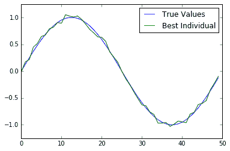

# 使用遗传算法

TensorFlow 还可用于更新我们可以在计算图中表达的任何迭代算法。一种这样的迭代算法是遗传算法，即优化过程。

## 做好准备

在本文中，我们将说明如何实现简单的遗传算法。遗传算法是优化任何参数空间（离散，连续，平滑，非平滑等）的一种方法。我们的想法是创建一组随机初始化的解决方案，并应用选择，重组和变异来生成新的（可能更好的）子解决方案。整个想法取决于我们可以通过查看个人解决问题的程度来计算个体解决方案的适用性。

通常，遗传算法的概要是从随机初始化的群体开始，根据它们的适应性对它们进行排序，然后选择最适合的个体来随机重组（或交叉）以创建新的子解决方案。然后，这些子解决方案会稍微突变，以产生新的和看不见的改进，然后再添加回父群体。在我们将孩子和父母结合起来之后，我们再次重复整个过程。

停止遗传算法的标准各不相同，但出于我们的目的，我们将迭代它们一定数量的世代。当我们最适合的人达到理想的适应水平或者在这么多代之后最大适应度没有改变时，我们也可以停止。

对于这个秘籍，我们将简单地说明如何在 Tensorflow 中执行此操作。我们要解决的问题是生成一个最接近地面实况函数的个体（50 个浮点数的数组）`f(x) = sin(2πx / 50)`。适应度将是个体与地面事实之间的均方误差（越高越好）的负值。

## 操作步骤

1.  我们首先加载脚本所需的库：

```py
import os 
import numpy as np 
import matplotlib.pyplot as plt 
import tensorflow as tf 
```

1.  接下来，我们将设置遗传算法的参数。在这里，我们将有`100`个体，每个个体的长度为`50`。选择百分比为 20％（保持前 20 名个人）。突变将被设置为特征数量的倒数，这是突变开始的常见位置。这意味着我们希望每个子解决方案的一个特征发生变化。我们将为`200`世代运行遗传算法：

```py
pop_size = 100 
features = 50 
selection = 0.2 
mutation = 1./ features 
generations = 200 
num_parents = int(pop_size*selection) 
num_children = pop_size - num_parents 
```

1.  我们将初始化图会话并创建基础事实函数，我们将使用它来快速计算适应度：

```py
sess = tf.Session() 
# Create ground truth 
truth = np.sin(2*np.pi*(np.arange(features, dtype=np.float32))/features) 
```

1.  接下来，我们将`population`初始化为具有随机正常输入的 TensorFlow 变量：

```py
population = tf.Variable(np.random.randn(pop_size, features), dtype=tf.float32) 
```

1.  我们现在可以为遗传算法创建占位符。占位符是为了事实，也是为了每一代都会改变的数据。由于我们希望父母之间的交叉位置发生变化，并且变异概率/值会发生变化，因此这些将是我们模型中的占位符：

```py
truth_ph = tf.placeholder(tf.float32, [1, features]) 
crossover_mat_ph = tf.placeholder(tf.float32, [num_children, features]) 
mutation_val_ph = tf.placeholder(tf.float32, [num_children, features]) 
```

1.  现在，我们将计算人口`fitness`（负均方误差），并找到表现最佳的人：

```py
fitness = -tf.reduce_mean(tf.square(tf.subtract(population, truth_ph)), 1) 
top_vals, top_ind = tf.nn.top_k(fitness, k=pop_size) 
```

1.  为了达到结果和绘图目的，我们还希望检索人群中最适合的个体：

```py
best_val = tf.reduce_min(top_vals) 
best_ind = tf.argmin(top_vals, 0) 
best_individual = tf.gather(population, best_ind) 
```

1.  接下来，我们对父母群体进行排序，并切断表现最佳的个体，使其成为下一代的父母：

```py
population_sorted = tf.gather(population, top_ind) 
parents = tf.slice(population_sorted, [0, 0], [num_parents, features]) 
```

1.  现在，我们将通过创建随机洗牌的两个父矩阵来创建子项。然后，我们将父矩阵乘以 1 和 0 的交叉矩阵，我们将为占位符生成每一代：

```py
# Indices to shuffle-gather parents 
rand_parent1_ix = np.random.choice(num_parents, num_children) 
rand_parent2_ix = np.random.choice(num_parents, num_children) 
# Gather parents by shuffled indices, expand back out to pop_size too 
rand_parent1 = tf.gather(parents, rand_parent1_ix) 
rand_parent2 = tf.gather(parents, rand_parent2_ix) 
rand_parent1_sel = tf.multiply(rand_parent1, crossover_mat_ph) 
rand_parent2_sel = tf.multiply(rand_parent2, tf.subtract(1., crossover_mat_ph)) 
children_after_sel = tf.add(rand_parent1_sel, rand_parent2_sel) 
```

1.  最后的步骤是改变子项，我们将通过向子矩阵中的少量条目添加随机正常量并将此矩阵连接回父族：

```py
mutated_children = tf.add(children_after_sel, mutation_val_ph) 
# Combine children and parents into new population 
new_population = tf.concat(0, [parents, mutated_children]) 
```

1.  我们模型的最后一步是使用 TensorFlow 的`group()`操作将新种群分配给旧种群的变量：

```py
step = tf.group(population.assign(new_population)) 
```

1.  我们现在可以初始化模型变量，如下所示：

```py
init = tf.global_variables_initializer() 
sess.run(init) 
```

1.  最后，我们遍历世代，重新创建随机交叉和变异矩阵并更新每一代的人口：

```py
for i in range(generations): 
    # Create cross-over matrices for plugging in. 
    crossover_mat = np.ones(shape=[num_children, features]) 
    crossover_point = np.random.choice(np.arange(1, features-1, step=1), num_children) 
    for pop_ix in range(num_children): 
        crossover_mat[pop_ix,0:crossover_point[pop_ix]]=0\. 
    # Generate mutation probability matrices 
    mutation_prob_mat = np.random.uniform(size=[num_children, features]) 
    mutation_values = np.random.normal(size=[num_children, features]) 
    mutation_values[mutation_prob_mat >= mutation] = 0 

    # Run GA step 
    feed_dict = {truth_ph: truth.reshape([1, features]), 
                 crossover_mat_ph: crossover_mat, 
                 mutation_val_ph: mutation_values} 
    step.run(feed_dict, session=sess) 
    best_individual_val = sess.run(best_individual, feed_dict=feed_dict) 

    if i % 5 == 0: 
       best_fit = sess.run(best_val, feed_dict = feed_dict) 
       print('Generation: {}, Best Fitness (lowest MSE): {:.2}'.format(i, -best_fit)) 
```

1.  这导致以下输出：

```py
Generation: 0, Best Fitness (lowest MSE): 1.5 
Generation: 5, Best Fitness (lowest MSE): 0.83 
Generation: 10, Best Fitness (lowest MSE): 0.55 
Generation: 185, Best Fitness (lowest MSE): 0.085 
Generation: 190, Best Fitness (lowest MSE): 0.15 
Generation: 195, Best Fitness (lowest MSE): 0.083 
```

## 工作原理

在本文中，我们向您展示了如何使用 TensorFlow 运行简单的遗传算法。为了验证它是否有效，我们还可以在一个图上查看最合适的个体解决方案和基本事实：



图 4：200 代后的真实情况和最适合个体的绘图图。我们可以看到，最合适的个体非常接近真相

## 更多

遗传算法有许多变化。我们可以有两个具有两个不同适合度标准的父母群体（例如，最低 MSE 和平滑度）。我们可以对突变值施加限制，使其不大于 1 或小于-1。我们可以进行许多不同的更改，这些更改会有很大差异，具体取决于我们要优化的问题。对于这个人为的问题，很容易计算出适应度，但对于大多数遗传算法来说，计算适应度是一项艰巨的任务。例如，如果我们想使用遗传算法来优化卷积神经网络的架构，我们可以让个体成为参数数组。参数可以代表每个卷积层的滤波器大小，步幅大小等。这种个体的适应性将是在通过数据集的固定量的迭代之后的分类的准确率。如果我们在这个人口中有 100 个人，我们将不得不为每一代评估 100 个不同的 CNN 模型。这在计算上非常强烈。

在使用遗传算法解决问题之前，明智的做法是弄清楚计算个体的`fitness`需要多长时间。如果此操作耗时，遗传算法可能不是最佳使用工具。