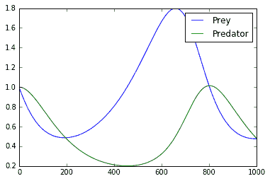

# 求解常微分方程组

TensorFlow 可用于许多算法实现和过程。 TensorFlow 多功能性的一个很好的例子是实现 ODE 求解器。以数字方式求解 ODE 是一种迭代过程，可以在计算图中轻松描述。对于这个秘籍，我们将解决 Lotka-Volterra 捕食者 - 猎物系统。

## 做好准备

该秘籍将说明如何求解常微分方程（ODE）系统。我们可以使用与前两节类似的方法来更新值，因为我们迭代并解决 ODE 系统。

我们将考虑的 ODE 系统是着名的 Lotka-Volterra 捕食者 - 猎物系统。该系统显示了捕食者 - 食饵系统如何在给定特定参数的情况下振荡。

Lotka-Volterra 系统于 1920 年在一篇论文中发表（参见图 1，标量值，我们的斜率估计，在张量板中可视化）。我们将使用类似的参数来表明可以发生振荡系统。这是以数学上离散的方式表示的系统：


在这里，`X`是猎物，`Y`将成为捕食者。我们通过`a`，`b`，`c`和`d`的值来确定哪个是猎物，哪个是捕食者：对于猎物，`a&gt;0`，`b&lt;0`和捕食者，`c&lt;0`，`d&gt;0`。我们将在 TensorFlow 解决方案中将此离散版本实现到系统中。

## 操作步骤

1.  我们首先加载库并开始图会话：

```py
import matplotlib.pyplot as plt 
import tensorflow as tf 
sess = tf.Session() 
```

1.  然后我们在图中声明我们的常量和变量：

```py
x_initial = tf.constant(1.0) 
y_initial = tf.constant(1.0) 
X_t1 = tf.Variable(x_initial) 
Y_t1 = tf.Variable(y_initial) 
# Make the placeholders 
t_delta = tf.placeholder(tf.float32, shape=()) 
a = tf.placeholder(tf.float32, shape=()) 
b = tf.placeholder(tf.float32, shape=()) 
c = tf.placeholder(tf.float32, shape=()) 
d = tf.placeholder(tf.float32, shape=()) 
```

1.  接下来，我们将实现先前引入的离散系统，然后更新`X`和`Y`群体：

```py
X_t2 = X_t1 + (a * X_t1 + b * X_t1 * Y_t1) * t_delta 
Y_t2 = Y_t1 + (c * Y_t1 + d * X_t1 * Y_t1) * t_delta 
# Update to New Population 
step = tf.group( 
  X_t1.assign(X_t2), 
  Y_t1.assign(Y_t2)) 
```

1.  我们现在初始化图并运行离散 ODE 系统，并使用特定参数来说明循环行为：

```py
init = tf.global_variables_initializer() sess.run(init) # Run the ODE prey_values = [] predator_values = [] for i in range(1000): # Step simulation (using constants for a known cyclic solution) step.run({a: (2./3.), b: (-4./3.), c: -1.0, d: 1.0, t_delta: 0.01}, session=sess) # Store each outcome temp_prey, temp_pred = sess.run([X_t1, Y_t1]) prey_values.append(temp_prey) predator_values.append(temp_pred)
```

A steady state (and cyclic) solution to this specific system, the Lotka-Volterra equations, very much depends on specific parameters and population values. We encourage the reader to try different parameters and values to see what can happen.

1.  现在，我们可以绘制捕食者和猎物的价值：

```py
plt.plot(prey_values, label="Prey") 
plt.plot(predator_values, label="Predator") 
plt.legend(loc='upper right') 
plt.show() 
```

这个绘图代码将生成一个屏幕截图，显示掠食者和猎物的振荡种群：



图 6：在这里，我们绘制 ODE 解决方案的捕食者和猎物值。事实上，我们可以看到周期确实发生了

## 工作原理

我们使用 TensorFlow 逐步求解 ODE 系统的离散版本。对于特定参数，我们看到捕食者 - 食饵系统确实可以具有循环解。这在我们的系统生物学上是有意义的，因为如果有太多的捕食者，猎物开始死亡，然后掠食者的食物就会减少，所以他们会死掉，等等。

## 另见

[Lotka，A.J.，关于有机系统中某些节奏关系的分析性说明](https://www.ncbi.nlm.nih.gov/pmc/articles/PMC1084562/)。