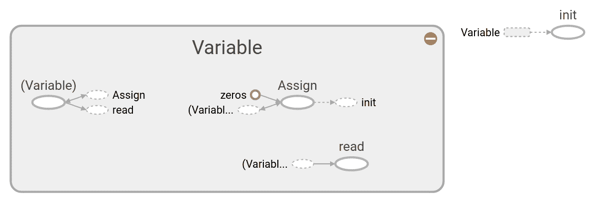
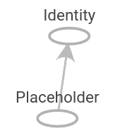
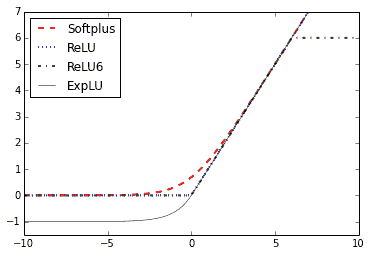

# 一、TensorFlow 入门

在本章中，我们将介绍一些基本的秘籍，以便了解 TensorFlow 的工作原理以及如何访问本书的数据和其他资源。

到本章结束时，您应该了解以下内容：

*   TensorFlow 如何工作
*   声明变量和张量
*   使用占位符和变量
*   使用矩阵
*   声明操作符
*   实现激活函数
*   使用数据源
*   其他资源

# 介绍

谷歌的 TensorFlow 引擎有一种解决问题的独特方式。这种独特的方式使我们能够非常有效地解决机器学习问题。机器学习几乎用于生活和工作的所有领域，但一些更着名的领域是计算机视觉，语音识别，语言翻译，医疗保健等等。我们将介绍了解 TensorFlow 如何运行的基本步骤，并最终在本书后面构建生产代码技术。这些基础知识对于理解本书其余部分的秘籍非常重要。

# TensorFlow 如何工作

起初，TensorFlow 中的计算可能看起来不必要地复杂化。但有一个原因：由于 TensorFlow 如何处理计算，开发更复杂的算法相对容易。该秘籍将指导我们完成 TensorFlow 算法的伪代码。

## 准备

目前，TensorFlow 在 Linux，macOS 和 Windows 上受支持。本书的代码已经在 Linux 系统上创建和运行，但也应该在任何其他系统上运行。该书的代码可在 [GitHub](https://github.com/nfmcclure/tensorflow_cookbook) 以及[ Packt 仓库](https://github.com/PacktPublishing/TensorFlow-Machine-Learning-Cookbook-Second-Edition)中找到。

在本书中，我们只关注 TensorFlow 的 Python 库包装器，尽管 TensorFlow 的大多数原始核心代码都是用 C ++编写的。本书将使用 [Python 3.6+](https://www.python.org) 和 [TensorFlow 1.10.0+](https://www.tensorflow.org)。虽然 TensorFlow 可以在 CPU 上运行，但是如果在 GPU 上处理，大多数算法运行得更快，并且在具有 Nvidia Compute Capability v4.0 +（推荐 v5.1）的显卡上支持。

TensorFlow 的流行 GPU 是 Nvidia Tesla 架构和具有至少 4 GB 视频 RAM 的 Pascal 架构。要在 GPU 上运行，您还需要下载并安装 Nvidia CUDA 工具包以及[版本 5.x+](https://developer.nvidia.com/cuda-downloads)。

本章中的一些秘籍将依赖于当前安装的 SciPy，NumPy 和 scikit-learn Python 包。这些随附的软件包也包含在[ Anaconda 软件包](https://www.continuum.io/downloads)中。

## 操作步骤

在这里，我们将介绍 TensorFlow 算法的一般流程。大多数秘籍将遵循以下大纲：

1.  导入或生成数据集：我们所有的机器学习算法都依赖于数据集。在本书中，我们将生成数据或使用外部数据集源。有时，最好依赖生成的数据，因为我们只想知道预期的结果。大多数情况下，我们将访问给定秘籍的公共数据集。有关访问这些数据集的详细信息，请参见本章第 8 节的其他资源。
2.  转换和正则化数据：通常，输入数据集不会出现在图片中。 TensorFlow 期望我们需要转换 TensorFlow，以便它们获得可接受的形状。数据通常不在我们的算法所期望的正确维度或类型中。在我们使用之前，我们必须转换数据。大多数算法也期望归一化数据，我们也会在这里看一下。 TensorFlow 具有内置函数，可以为您正则化数据，如下所示：

```py
import tensorflow as tf
data = tf.nn.batch_norm_with_global_normalization(...) 
```

1.  将数据集划分为训练集，测试集和验证集：我们通常希望在我们训练过的不同集上测试我们的算法。此外，许多算法需要超参数调整，因此我们留出一个验证集来确定最佳的超参数集。
2.  设置算法参数（超参数）：我们的算法通常有一组参数，我们在整个过程中保持不变。例如，这可以是我们选择的迭代次数，学习率或其他固定参数。将这些一起初始化是一种良好的做法，以便读者或用户可以轻松找到它们，如下所示：

```py
learning_rate = 0.01 
batch_size = 100 
iterations = 1000
```

1.  初始化变量和占位符：TensorFlow 依赖于知道它能够和不能修改的内容。 TensorFlow 将在优化期间修改/调整变量（模型权重/偏差）以最小化损失函数。为此，我们通过占位符提供数据。我们需要初始化变量和占位符的大小和类型，以便 TensorFlow 知道会发生什么。 TensorFlow 还需要知道期望的数据类型。对于本书的大部分内容，我们将使用`float32`。 TensorFlow 还提供`float64`和`float16`。请注意，用于精度的更多字节会导致算法速度变慢，但使用较少会导致精度降低。请参阅以下代码：

```py
a_var = tf.constant(42) 
x_input = tf.placeholder(tf.float32, [None, input_size]) 
y_input = tf.placeholder(tf.float32, [None, num_classes]) 
```

1.  定义模型结构：在获得数据并初始化变量和占位符之后，我们必须定义模型。这是通过构建计算图来完成的。我们将在第 2 章，TensorFlow 方法中更详细地讨论计算图 TensorFlow 秘籍中的运算中的计算图。此示例的模型将是线性模型（`y = mx + b`）：

```py
y_pred = tf.add(tf.mul(x_input, weight_matrix), b_matrix) 
```

1.  声明损失函数：定义模型后，我们必须能够评估输出。这是我们宣布损失函数的地方。损失函数非常重要，因为它告诉我们预测距实际值有多远。在第 2 章，TensorFlow 方法中的实现反向传播秘籍中更详细地探讨了不同类型的损失函数。在这里，我们实现了 n 点的均方误差，即：

    

```py
loss = tf.reduce_mean(tf.square(y_actual - y_pred)) 
```

1.  初始化和训练模型：现在我们已经完成了所有工作，我们需要创建图实例，通过占位符输入数据，让 TensorFlow 更改变量以更好地预测我们的训练数据。这是初始化计算图的一种方法：

```py
with tf.Session(graph=graph) as session: 
... 
session.run(...) 
... 
Note that we can also initiate our graph with:
session = tf.Session(graph=graph) 
session.run(...) 
```

1.  评估模型：一旦我们构建并训练了模型，我们应该通过查看通过某些指定标准对新数据的处理程度来评估模型。我们对训练和测试装置进行评估，这些评估将使我们能够看到模型是否过拟合。我们将在后面的秘籍中解决这个问题。
2.  调整超参数：大多数情况下，我们希望根据模型的表现返回并更改一些超参数。然后，我们使用不同的超参数重复前面的步骤，并在验证集上评估模型。
3.  部署/预测新结果：了解如何对新数据和未见数据进行预测也很重要。一旦我们对他们进行了训练，我们就可以对所有模型进行此操作。

## 工作原理

在 TensorFlow 中，我们必须先设置数据，变量，占位符和模型，然后才能告诉程序训练和更改变量以改进预测。 TensorFlow 通过计算图完成此任务。这些计算图是没有递归的有向图，这允许计算并行性。为此，我们需要为 TensorFlow 创建一个最小化的损失函数。 TensorFlow 通过修改计算图中的变量来实现此目的。 TensorFlow 知道如何修改变量，因为它跟踪模型中的计算并自动计算变量梯度（如何更改每个变量）以最小化损失。因此，我们可以看到进行更改和尝试不同数据源是多么容易。

## 另见

有关 TensorFlow 的更多介绍和资源，请参阅官方文档和教程：

*   [一个更好的起点是官方 Python API 文档](https://www.tensorflow.org/api_docs/python/)
*   [还有教程](https://www.tensorflow.org/tutorials/)
*   [TensorFlow 教程，项目，演示文稿和代码仓库的非官方集合](https://github.com/jtoy/awesome-tensorflow)

# 声明变量和张量

张量是 TensorFlow 用于在计算图上操作的主要数据结构。我们可以将这些张量声明为变量和/或将它们作为占位符提供。要做到这一点，首先，我们必须学习如何创建张量。

> `tensor`是指广义向量或矩阵的数学术语。如果向量是一维的并且矩阵是二维的，则张量是 n 维的（其中`n`可以是 1,2 或甚至更大）。

## 准备

当我们创建一个张量并将其声明为变量时，TensorFlow 会在我们的计算图中创建几个图结构。同样重要的是要指出，仅通过创建张量，TensorFlow 不会向计算图中添加任何内容。 TensorFlow 仅在运行初始化变量的操作后执行此操作。有关更多信息，请参阅下一节有关变量和占位符的内容。

## 操作步骤

在这里，我们将介绍我们可以在 TensorFlow 中创建张量的主要方法：

1.固定张量：

*   *   在下面的代码中，我们创建了一个零填充张量：

```py
zero_tsr = tf.zeros([row_dim, col_dim])
```

*   *   在下面的代码中，我们创建了一个填充张量：

```py
ones_tsr = tf.ones([row_dim, col_dim]) 
```

*   *   在下面的代码中，我们创建了一个常量填充张量：

```py
filled_tsr = tf.fill([row_dim, col_dim], 42) 
```

*   *   在下面的代码中，我们从现有常量中创建一个张量：

```py
constant_tsr = tf.constant([1,2,3])
```

> 请注意，`tf.constant()`函数可用于将值广播到数组中，通过编写`tf.constant(42, [row_dim, col_dim])`来模仿`tf.fill()`的行为。

1.  相似形状的张量：我们还可以根据其他张量的形状初始化变量，如下所示：

```py
zeros_similar = tf.zeros_like(constant_tsr) 
ones_similar = tf.ones_like(constant_tsr) 
```

> 请注意，由于这些张量依赖于先前的张量，我们必须按顺序初始化它们。尝试一次初始化所有张量将导致错误。有关变量和占位符，请参阅下一节末尾的“更多”小节。

1.  序列张量：TensorFlow 允许我们指定包含定义间隔的张量。以下函数与 NumPy 的`linspace()`输出和`range()`输出非常相似。请参阅以下函数：

```py
linear_tsr = tf.linspace(start=0, stop=1, start=3) 
```

得到的张量具有[0.0,0.5,1.0]的序列。请注意，此函数包含指定的停止值。有关更多信息，请参阅以下函数：

```py
integer_seq_tsr = tf.range(start=6, limit=15, delta=3) 
```

结果是序列[6,9,12]。请注意，此函数不包括限制值。

1.  随机张量：以下生成的随机数来自均匀分布：

```py
randunif_tsr = tf.random_uniform([row_dim, col_dim], minval=0, maxval=1) 
```

注意，这种随机均匀分布来自包含`minval`但不包括`maxval`（`minval >= x < maxval`）的区间。

要从正态分布中获取随机抽取的张量，可以运行以下代码：

```py
randnorm_tsr = tf.random_normal([row_dim, col_dim], mean=0.0, stddev=1.0) 
```

有时候我们想要生成在某些范围内保证的正常随机值。 `truncated_normal()`函数总是在指定均值的两个标准偏差内选择正常值：

```py
runcnorm_tsr = tf.truncated_normal([row_dim, col_dim], mean=0.0, stddev=1.0) 
```

我们可能也对随机化数组条目感兴趣。要做到这一点，有两个函数可以帮助我们：`random_shuffle()`和`random_crop()`。以下代码执行此操作：

```py
shuffled_output = tf.random_shuffle(input_tensor) 
cropped_output = tf.random_crop(input_tensor, crop_size) 
```

在本书的后面，我们将有兴趣随机裁剪尺寸（高度，宽度，3）的图像，其中有三种颜色光谱。要修复`cropped_output`中的尺寸，您必须在该尺寸中为其指定最大尺寸：

```py
cropped_image = tf.random_crop(my_image, [height/2, width/2, 3]) 
```

## 工作原理

一旦我们决定如何创建张量，我们也可以通过在`Variable()`函数中包含张量来创建相应的变量，如下所示（下一节将详细介绍）：

```py
my_var = tf.Variable(tf.zeros([row_dim, col_dim])) 
```

## 更多

我们不仅限于内置函数：我们可以使用`convert_to_tensor()`函数将任何 NumPy 数组转换为 Python 列表，或将常量转换为张量。注意，如果我们希望概括函数内部的计算，该函数也接受张量作为输入。

# 使用占位符和变量

占位符和变量是在 TensorFlow 中使用计算图的关键工具。我们必须了解它们之间的区别以及何时最好地利用它们对我们有利。

## 准备

与数据最重要的区别之一是它是占位符还是变量。变量是算法的模型参数，TensorFlow 跟踪如何更改这些参数以优化算法。占位符是允许您提供特定类型和形状的数据的对象，或者取决于计算图的结果，例如计算的预期结果。

## 操作步骤

创建变量的主要方法是使用`Variable()`函数，该函数将张量作为输入并输出变量。这只是声明，我们仍然需要初始化变量。初始化是将变量与相应方法放在计算图上的内容。以下是创建和初始化变量的示例：

```py
my_var = tf.Variable(tf.zeros([2,3])) 
sess = tf.Session() 
initialize_op = tf.global_variables_initializer() 
sess.run(initialize_op) 
```

要在创建和初始化变量后查看计算图是什么样的，请参阅此秘籍的以下部分。占位符只是保持数据的位置以输入图。占位符从会话中的`feed_dict`参数获取数据。要将占位符放入图中，我们必须对占位符执行至少一个操作。在下面的代码片段中，我们初始化图，将`x`声明为占位符（预定义大小），并将`y`定义为`x`上的标识操作，它只返回`x`。然后，我们创建数据以提供给`x`占位符并运行身份操作。代码如下所示，结果图如下：

```py
sess = tf.Session() 
x = tf.placeholder(tf.float32, shape=[2,2]) 
y = tf.identity(x) 
x_vals = np.random.rand(2,2) 
sess.run(y, feed_dict={x: x_vals}) 
# Note that sess.run(x, feed_dict={x: x_vals}) will result in a self-referencing error. 
```

> 值得注意的是，TensorFlow 不会在 Feed 字典中返回自引用占位符。换句话说，在下图中运行`sess.run(x, feed_dict={x: x_vals})`将返回错误。

## 工作原理

将变量初始化为零张量的计算图如下图所示：



图 1：变量

在这里，我们只用一个变量就可以看到计算图的详细信息，并将其全部初始化为零。灰色阴影区域是对所涉及的操作和常数的非常详细的视图。细节较少的主要计算图是右上角灰色区域之外的较小图。有关创建和可视化图的更多详细信息，请参阅第 10 章的第一部分，将 TensorFlow 转换为生产。类似地，可以在下图中看到将 NumPy 数组送入占位符的计算图：



图 2：初始化占位符的计算图

灰色阴影区域是对所涉及的操作和常数的非常详细的视图。细节较少的主要计算图是右上角灰色区域之外的较小图。

## 更多

在计算图运行期间，我们必须告诉 TensorFlow 何时初始化我们创建的变量。虽然每个变量都有一个`initializer`方法，但最常用的方法是使用辅助函数，即`global_variables_initializer()`。此函数在图中创建一个初始化我们创建的所有变量的操作，如下所示：

```py
initializer_op = tf.global_variables_initializer() 
```

但是如果我们想根据初始化另一个变量的结果来初始化变量，我们必须按照我们想要的顺序初始化变量，如下所示：

```py
sess = tf.Session() 
first_var = tf.Variable(tf.zeros([2,3])) 
sess.run(first_var.initializer) 
second_var = tf.Variable(tf.zeros_like(first_var)) 
# 'second_var' depends on the 'first_var'
sess.run(second_var.initializer)
```

# 使用矩阵

了解 TensorFlow 如何与矩阵一起工作对于通过计算图来理解数据流非常重要。

> 值得强调的是矩阵在机器学习（以及一般数学）中的重要性。大多数机器学习算法在计算上表示为矩阵运算。本书未涉及矩阵属性和矩阵代数（线性代数）的数学背景，因此强烈建议读者充分了解矩阵以适应矩阵代数。

## 准备

许多算法依赖于矩阵运算。 TensorFlow 为我们提供了易于使用的操作来执行此类矩阵计算。对于以下所有示例，我们首先通过运行以下代码来创建图会话：

```py
import tensorflow as tf 
sess = tf.Session() 
```

## 操作步骤

我们将按如下方式处理秘籍：

1.  创建矩阵：我们可以从 NumPy 数组或嵌套列表创建二维矩阵，正如我们在创建和使用张量秘籍中所描述的那样。我们还可以使用张量创建函数并为`zeros()`，`ones()`，`truncated_normal()`等函数指定二维形状。 TensorFlow 还允许我们使用`diag()`函数从一维数组或列表创建对角矩阵，如下所示：

```py
identity_matrix = tf.diag([1.0, 1.0, 1.0]) 
A = tf.truncated_normal([2, 3]) 
B = tf.fill([2,3], 5.0) 
C = tf.random_uniform([3,2]) 
D = tf.convert_to_tensor(np.array([[1., 2., 3.],[-3., -7., -1.],[0., 5., -2.]])) 
print(sess.run(identity_matrix)) 
[[ 1\.  0\.  0.] 
 [ 0\.  1\.  0.] 
 [ 0\.  0\.  1.]] 
print(sess.run(A)) 
[[ 0.96751703  0.11397751 -0.3438891 ] 
 [-0.10132604 -0.8432678   0.29810596]] 
print(sess.run(B)) 
[[ 5\.  5\.  5.] 
 [ 5\.  5\.  5.]] 
print(sess.run(C)) 
[[ 0.33184157  0.08907614] 
 [ 0.53189191  0.67605299] 
 [ 0.95889051 0.67061249]] 
print(sess.run(D)) 
[[ 1\.  2\.  3.] 
 [-3\. -7\. -1.] 
 [ 0\.  5\. -2.]] 
```

> 请注意，如果我们再次运行`sess.run(C)`，我们将重新初始化随机变量并最终得到不同的随机值。

1.  加法，减法和乘法：要添加，减去或相乘相同维度的矩阵，TensorFlow 使用以下函数：

```py
print(sess.run(A+B)) 
[[ 4.61596632  5.39771316  4.4325695 ] 
 [ 3.26702736  5.14477345  4.98265553]] 
print(sess.run(B-B)) 
[[ 0\.  0\.  0.] 
 [ 0\.  0\.  0.]] 
Multiplication 
print(sess.run(tf.matmul(B, identity_matrix))) 
[[ 5\.  5\.  5.] 
 [ 5\.  5\.  5.]] 
```

值得注意的是，`matmul()`函数具有参数，用于指定是否在乘法之前转置参数或每个矩阵是否稀疏。

> 请注意，未明确定义矩阵除法。虽然许多人将矩阵划分定义为乘以逆，但与实数除法相比，它基本上是不同的。

1.  转置：转置矩阵（翻转列和行），如下所示：

```py
print(sess.run(tf.transpose(C))) 
[[ 0.67124544  0.26766731  0.99068872] 
 [ 0.25006068  0.86560275  0.58411312]] 
```

同样，值得一提的是，重新初始化为我们提供了与以前不同的价值观。

1.  行列式：要计算行列式，请使用以下内容：

```py
print(sess.run(tf.matrix_determinant(D))) 
-38.0 
```

1.  反向：要查找方阵的倒数，请参阅以下内容：

```py
print(sess.run(tf.matrix_inverse(D))) 
[[-0.5        -0.5        -0.5       ] 
 [ 0.15789474  0.05263158  0.21052632] 
 [ 0.39473684  0.13157895  0.02631579]] 
```

> 只有当矩阵是对称正定时，逆方法才基于 Cholesky 分解。如果矩阵不是对称正定，那么它基于 LU 分解。

1.  分解：对于 Cholesky 分解，请使用以下内容：

```py
print(sess.run(tf.cholesky(identity_matrix))) 
[[ 1\.  0\.  1.] 
 [ 0\.  1\.  0.] 
 [ 0\.  0\.  1.]] 
```

1.  特征值和特征向量：对于特征值和特征向量，请使用以下代码：

```py
print(sess.run(tf.self_adjoint_eig(D)) 
[[-10.65907521  -0.22750691   2.88658212] 
 [  0.21749542   0.63250104  -0.74339638] 
 [  0.84526515   0.2587998    0.46749277] 
 [ -0.4880805    0.73004459   0.47834331]] 
```

注意，`self_adjoint_eig()`函数输出第一行中的特征值和剩余向量中的后续向量。在数学中，这被称为矩阵的特征分解。

## 工作原理

TensorFlow 为我们提供了开始使用数值计算并将这些计算添加到图中的所有工具。对于简单的矩阵运算，这种表示法可能看起来很重。请记住，我们正在将这些操作添加到图中，并告诉 TensorFlow 哪些张量运行这些操作。虽然现在看起来似乎很冗长，但它有助于我们理解后面章节中的符号，这种计算方式将使我们更容易实现目标。

# 声明操作符

现在，我们必须了解我们可以添加到 TensorFlow 图的其他操作。

## 准备

除了标准算术运算之外，TensorFlow 还为我们提供了更多我们应该了解的操作以及如何在继续操作之前使用它们。同样，我们可以通过运行以下代码来创建图会话：

```py
import tensorflow as tf 
sess = tf.Session() 
```

## 操作步骤

TensorFlow 对张量有标准操作，即`add()`，`sub()`，`mul()`和`div()`。请注意，除非另有说明，否则本节中的所有操作都将按元素评估输入：

1.  TensorFlow 提供了`div()`和相关函数的一些变体。
2.  值得一提的是`div()`返回与输入相同的类型。这意味着如果输入是整数，它确实返回了分区的底线（类似于 Python 2）。要返回 Python 3 版本，它在分割之前将整数转换为浮点数并始终返回浮点数，TensorFlow 提供`truediv()`函数，如下所示：

```py
print(sess.run(tf.div(3, 4))) 
0 
print(sess.run(tf.truediv(3, 4))) 
0.75 
```

1.  如果我们有浮点数并想要整数除法，我们可以使用`floordiv()`函数。请注意，这仍然会返回一个浮点数，但它会向下舍入到最接近的整数。这个函数如下：

```py
print(sess.run(tf.floordiv(3.0,4.0))) 
0.0 
```

1.  另一个重要函数是`mod()`。此函数返回除法后的余数。它如下：

```py
print(sess.run(tf.mod(22.0, 5.0))) 
2.0 
```

1.  两个张量之间的交叉积通过`cross()`函数实现。请记住，交叉乘积仅针对两个三维向量定义，因此它只接受两个三维张量。以下代码说明了这种用法：

```py
print(sess.run(tf.cross([1., 0., 0.], [0., 1., 0.]))) 
[ 0\.  0\.  1.0]
```

1.  这是一个更常见的数学函数的紧凑列表。所有这些函数都以元素方式运行：

| | |
| --- | --- |
| `abs()` | 一个输入张量的绝对值 |
| `ceil()` | 一个输入张量的向上取整函数 |
| `cos()` | 一个输入张量的余弦函数 |
| `exp()` | 基于`e`指数的一个输入张量 |
| `floor()` | 一个输入张量的向下取整函数 |
| `inv()` | 一个输入张量的乘法逆（1 / x） |
| `log()` | 一个输入张量的自然对数 |
| `maximum()` | 元素最多两个张量 |
| `minimum()` | 两个张量的元素分钟 |
| `neg()` | 负输入张量为负 |
| `pow()` | 第一个张量元素提升到第二个张量元素 |
| `round()` | 舍入一个输入张量 |
| `rsqrt()` | 一个超过一个张量的平方根 |
| `sign()` | 返回-1,0 或 1，具体取决于张量的符号 |
| `sin()` | 一个输入张量的正弦函数 |
| `sqrt()` | 一个输入张量的平方根 |
| `square()` | 一个输入张量的平方 |

1.  专业数学函数：有一些特殊的数学函数可以在机器学习中使用，值得一提，TensorFlow 为它们提供了内置函数。同样，除非另有说明，否则这些函数在元素方面运行：

| | |
| --- | --- |
| `digamma()` | Psi 函数，`lgamma()`函数的导数 |
| `erf()` | 高斯误差函数，元素方式，一个张量 |
| `erfc()` | 一个张量的互补误差函数 |
| `igamma()` | 降低正则化的不完全伽玛函数 |
| `igammac()` | 上正则化不完全伽马函数 |
| `lbeta()` | β函数绝对值的自然对数 |
| `lgamma()` | 伽玛函数绝对值的自然对数 |
| `squared_difference()` | 计算两个张量之间差异的平方 |

## 工作原理

重要的是要知道我们可以使用哪些函数，以便我们可以将它们添加到我们的计算图中。我们将主要关注前面的函数。我们还可以生成许多不同的自定义函数作为前面的组合，如下所示：

```py
# Tangent function (tan(pi/4)=1) 
print(sess.run(tf.tan(3.1416/4.)))
1.0 
```

## 更多

如果我们希望向我们未在此处列出的图添加其他操作，我们必须从前面的函数创建自己的操作。以下是我们之前未使用的操作示例，我们可以将其添加到图中。我们选择使用以下代码添加自定义多项式函数`3x^2 - x + 10`：

```py
def custom_polynomial(value): 
    return tf.sub(3 * tf.square(value), value) + 10
print(sess.run(custom_polynomial(11))) 
362 
```

# 实现激活函数

激活函数是神经网络近似非线性输出并适应非线性特征的关键。他们将非线性运算引入神经网络。如果我们小心选择了哪些激活函数以及放置它们的位置，它们是非常强大的操作，我们可以告诉 TensorFlow 适合和优化。

## 准备

当我们开始使用神经网络时，我们将定期使用激活函数，因为激活函数是任何神经网络的重要组成部分。激活函数的目标只是调整权重和偏差。在 TensorFlow 中，激活函数是作用于张量的非线性操作。它们是以与先前的数学运算类似的方式运行的函数。激活函数有很多用途，但主要的概念是它们在对输出进行归一化的同时在图中引入了非线性。使用以下命令启动 TensorFlow 图：

```py
import tensorflow as tf 
sess = tf.Session() 
```

## 操作步骤

激活函数存在于 TensorFlow 中的神经网络（nn）库中。除了使用内置激活函数外，我们还可以使用 TensorFlow 操作设计自己的函数。我们可以导入预定义的激活函数（`import tensorflow.nn as nn`）或显式，并在函数调用中写入`nn`。在这里，我们选择明确每个函数调用：

1.  被整流的线性单元，称为 ReLU，是将非线性引入神经网络的最常见和最基本的方式。这个函数叫做`max(0,x)`。它是连续的，但不是平滑的。它看起来如下：

```py
print(sess.run(tf.nn.relu([-3., 3., 10.]))) 
[  0\.  3\.  10.] 
```

1.  有时我们会想要限制前面的 ReLU 激活函数的线性增加部分。我们可以通过将`max(0,x)`函数嵌套到`min()`函数中来实现。 TensorFlow 具有的实现称为 ReLU6 函数。这被定义为`min(max(0,x),6)`。这是硬 sigmoid 函数的一个版本，并且计算速度更快，并且不会消失（无穷小接近零）或爆炸值。当我们在第 8 章，卷积神经网络和第 9 章，循环神经网络中讨论更深层的神经网络时，这将派上用场。它看起来如下：

```py
print(sess.run(tf.nn.relu6([-3., 3., 10.]))) 
[ 0\. 3\. 6.]
```

1.  S 形函数是最常见的连续和平滑激活函数。它也被称为逻辑函数，其形式为`1 / (1 + exp(-x))`。 Sigmoid 函数不经常使用，因为它倾向于在训练期间将反向传播术语置零。它看起来如下：

```py
print(sess.run(tf.nn.sigmoid([-1., 0., 1.]))) 
[ 0.26894143  0.5         0.7310586 ] 
```

> 我们应该知道一些激活函数不是以零为中心的，例如 sigmoid。这将要求我们在大多数计算图算法中使用之前将数据归零。

1.  另一个平滑激活函数是超切线。超正切函数与 sigmoid 非常相似，除了它的范围在 0 和 1 之间，它的范围在-1 和 1 之间。该函数具有双曲正弦与双曲余弦的比率的形式。写这个的另一种方法是`(exp(x) - exp(-x)) / (exp(x) + exp(-x))`。此激活函数如下：

```py
print(sess.run(tf.nn.tanh([-1., 0., 1.]))) 
[-0.76159418  0\.         0.76159418 ] 
```

1.  `softsign`函数也可用作激活函数。该函数的形式是`x / (|x| + 1)`。 `softsign`函数应该是符号函数的连续（但不是平滑）近似。请参阅以下代码：

```py
print(sess.run(tf.nn.softsign([-1., 0., -1.]))) 
[-0.5  0\.   0.5] 
```

1.  另一个函数是`softplus`函数，是 ReLU 函数的流畅版本。该函数的形式是`log(exp(x) + 1)`。它看起来如下：

```py
print(sess.run(tf.nn.softplus([-1., 0., -1.]))) 
[ 0.31326166  0.69314718  1.31326163] 
```

> 当输入增加时，`softplus`函数变为无穷大，而`softsign`函数变为 1.然而，当输入变小时，`softplus`函数接近零，`softsign`函数变为-1。

1.  指数线性单元（ELU）与 softplus 函数非常相似，只是底部渐近线为 -1 而不是 0.如果`x < 0`其他`x`，则形式为`exp(x) + 1`。它看起来如下：

```py
print(sess.run(tf.nn.elu([-1., 0., -1.]))) 
[-0.63212055  0\.          1\.        ] 
```

## 工作原理

这些激活函数是我们将来可以在神经网络或其他计算图中引入非线性的方法。重要的是要注意我们的网络中我们使用激活函数的位置。如果激活函数的范围在 0 和 1（sigmoid）之间，则计算图只能输出 0 到 1 之间的值。如果激活函数在内部并隐藏在节点之间，那么我们想要知道当我们传递它们时，范围可以在我们的张量上。如果我们的张量被缩放到平均值为零，我们将希望使用一个激活函数来保持尽可能多的方差在零附近。这意味着我们想要选择激活函数，例如双曲正切（tanh）或 softsign。如果张量都被缩放为正数，那么我们理想地选择一个激活函数来保留正域中的方差。

## 更多

以下是两个绘图，说明了不同的激活函数。下图显示了 ReLU，ReLU6，softplus，指数 LU，sigmoid，softsign 和双曲正切函数：



图 3：softplus，ReLU，ReLU6 和指数 LU 的激活函数

在这里，我们可以看到四个激活函数：softplus，ReLU，ReLU6 和指数 LU。这些函数在零的左边展平并线性增加到零的右边，但 ReLU6 除外，其最大值为 6：


图 4：Sigmoid，双曲正切（tanh）和 softsign 激活函数

这是 sigmoid，双曲正切（tanh）和 softsign 激活函数。这些激活函数都是平滑的，具有`S n`形状。请注意，这些函数有两个水平渐近线。

# 使用数据源

对于本书的大部分内容，我们将依赖数据集的使用来适应机器学习算法。本节介绍如何通过 TensorFlow 和 Python 访问每个数据集。

> 一些数据源依赖于外部网站的维护，以便您可以访问数据。如果这些网站更改或删除此数据，则可能需要更新本节中的以下某些代码。您可以在作者的[ GitHub 页面](https://github.com/nfmcclure/tensorflow_cookbook)上找到更新的代码。

## 准备

在 TensorFlow 中，我们将使用的一些数据集构建在 Python 库中，一些将需要 Python 脚本下载，一些将通过 Internet 手动下载。几乎所有这些数据集都需要有效的 Internet 连接，以便您可以检索它们。

## 操作步骤

1.  虹膜数据：该数据集可以说是机器学习中使用的最经典的数据集，也可能是所有统计数据。它是一个数据集，可以测量三种不同类型鸢尾花的萼片长度，萼片宽度，花瓣长度和花瓣宽度：Iris setosa，Iris virginica 和 Iris versicolor。总共有 150 个测量值，这意味着每个物种有 50 个测量值。要在 Python 中加载数据集，我们将使用 scikit-learn 的数据集函数，如下所示：

```py
from sklearn import datasets 
iris = datasets.load_iris() 
print(len(iris.data)) 
150 
print(len(iris.target)) 
150 
print(iris.data[0]) # Sepal length, Sepal width, Petal length, Petal width 
[ 5.1 3.5 1.4 0.2] 
print(set(iris.target)) # I. setosa, I. virginica, I. versicolor 
{0, 1, 2} 
```

1.  出生体重数据：该数据最初来自 Baystate Medical Center，Springfield，Mass 1986（1）。该数据集包含出生体重的测量以及母亲和家族病史的其他人口统计学和医学测量。有 11 个变量的 189 个观测值。以下代码显示了如何在 Python 中访问此数据：

```py
import requests
birthdata_url = 'https://github.com/nfmcclure/tensorflow_cookbook/raw/master/01_Introduction/07_Working_with_Data_Sources/birthweight_data/birthweight.dat' 
birth_file = requests.get(birthdata_url) 
birth_data = birth_file.text.split('\r\n') 
birth_header = birth_data[0].split('\t') 
birth_data = [[float(x) for x in y.split('\t') if len(x)>=1] for y in birth_data[1:] if len(y)>=1]
print(len(birth_data)) 
189 
print(len(birth_data[0])) 
9
```

1.  波士顿住房数据：卡内基梅隆大学在其 StatLib 库中维护着一个数据集库。这些数据可通过[加州大学欧文分校的机器学习库](https://archive.ics.uci.edu/ml/index.php)轻松访问。有 506 个房屋价值观察，以及各种人口统计数据和住房属性（14 个变量）。以下代码显示了如何通过 Keras 库在 Python 中访问此数据：

```py
from keras.datasets import boston_housing
(x_train, y_train), (x_test, y_test) = boston_housing.load_data()
housing_header = ['CRIM', 'ZN', 'INDUS', 'CHAS', 'NOX', 'RM', 'AGE', 'DIS', 'RAD', 'TAX', 'PTRATIO', 'B', 'LSTAT', 'MEDV'] 
print(x_train.shape[0]) 
404 
print(x_train.shape[1]) 
13 
```

1.  MNIST 手写数据：MNIST（混合国家标准与技术研究院）数据集是较大的 NIST 手写数据库的子集。 MNIST 手写数据集托管在[ Yann LeCun 的网站](https://yann.lecun.com/exdb/mnist/)上。它是一个包含 70,000 个单元数字图像（0-9）的数据库，其中约 60,000 个用于训练集注释，10,000 个用于测试集。 TensorFlow 在图像识别中经常使用此数据集，TensorFlow 提供了访问此数据的内置函数。在机器学习中，提供验证数据以防止过拟合（目标泄漏）也很重要。因此，TensorFlow 将 5000 列训练图像留在验证集中。以下代码显示了如何在 Python 中访问此数据：

```py
from tensorflow.examples.tutorials.mnist import input_data 
mnist = input_data.read_data_sets("MNIST_data/"," one_hot=True) 
print(len(mnist.train.images)) 
55000 
print(len(mnist.test.images)) 
10000 
print(len(mnist.validation.images)) 
5000 
print(mnist.train.labels[1,:]) # The first label is a 3 
[ 0\.  0\.  0\.  1\.  0\.  0\.  0\.  0\.  0\.  0.] 
```

1.  垃圾邮件文本数据。 UCI 的机器学习数据集库还包含垃圾短信文本消息数据集。我们可以访问此`.zip`文件并获取垃圾邮件文本数据，如下所示：

```py
import requests 
import io 
from zipfile import ZipFile 
zip_url = 'http://archive.ics.uci.edu/ml/machine-learning-databases/00228/smsspamcollection.zip' 
r = requests.get(zip_url) 
z = ZipFile(io.BytesIO(r.content)) 
file = z.read('SMSSpamCollection') 
text_data = file.decode() 
text_data = text_data.encode('ascii',errors='ignore') 
text_data = text_data.decode().split('\n') 
text_data = [x.split('\t') for x in text_data if len(x)>=1] 
[text_data_target, text_data_train] = [list(x) for x in zip(*text_data)] 
print(len(text_data_train)) 
5574 
print(set(text_data_target)) 
{'ham', 'spam'} 
print(text_data_train[1]) 
Ok lar... Joking wif u oni... 
```

1.  电影评论数据：来自康奈尔大学的 Bo Pang 发布了一个电影评论数据集，将评论分为好或坏（3）。[您可以在以下网站上找到数据](http://www.cs.cornell.edu/people/pabo/movie-review-data/)。要下载，提取和转换此数据，我们可以运行以下代码：

```py
import requests 
import io 
import tarfile 
movie_data_url = 'http://www.cs.cornell.edu/people/pabo/movie-review-data/rt-polaritydata.tar.gz' 
r = requests.get(movie_data_url) 
# Stream data into temp object 
stream_data = io.BytesIO(r.content) 
tmp = io.BytesIO() 
while True: 
    s = stream_data.read(16384) 
    if not s: 
        break 
    tmp.write(s) 
    stream_data.close() 
tmp.seek(0) 
# Extract tar file 
tar_file = tarfile.open(fileobj=tmp, mode="r:gz") 
pos = tar_file.extractfile('rt-polaritydata/rt-polarity.pos') 
neg = tar_file.extractfile('rt-polaritydata/rt-polarity.neg') 
# Save pos/neg reviews (Also deal with encoding) 
pos_data = [] 
for line in pos: 
    pos_data.append(line.decode('ISO-8859-1').encode('ascii',errors='ignore').decode()) 
neg_data = [] 
for line in neg: 
    neg_data.append(line.decode('ISO-8859-1').encode('ascii',errors='ignore').decode()) 
tar_file.close() 
print(len(pos_data)) 
5331 
print(len(neg_data)) 
5331 
# Print out first negative review 
print(neg_data[0]) 
simplistic , silly and tedious . 
```

1.  CIFAR-10 图像数据：加拿大高级研究院发布了一个图像集，其中包含 8000 万个带标签的彩色图像（每个图像缩放为 32 x 32 像素）。有 10 种不同的目标类别（飞机，汽车，鸟类等）。 CIFAR-10 是包含 60,000 张图像的子集。训练集中有 50,000 个图像，测试集中有 10,000 个。由于我们将以多种方式使用此数据集，并且因为它是我们较大的数据集之一，因此我们不会在每次需要时运行脚本。要获取此数据集，请导航至[此链接](http://www.cs.toronto.edu/~kriz/cifar.html)并下载 CIFAR-10 数据集。我们将在相应的章节中介绍如何使用此数据集。
2.  莎士比亚文本数据的作品：Project Gutenberg（5）是一个发布免费书籍电子版的项目。他们一起编辑了莎士比亚的所有作品。以下代码显示了如何通过 Python 访问此文本文件：

```py
import requests 
shakespeare_url = 'http://www.gutenberg.org/cache/epub/100/pg100.txt' 
# Get Shakespeare text 
response = requests.get(shakespeare_url) 
shakespeare_file = response.content 
# Decode binary into string 
shakespeare_text = shakespeare_file.decode('utf-8') 
# Drop first few descriptive paragraphs. 
shakespeare_text = shakespeare_text[7675:] 
print(len(shakespeare_text)) # Number of characters 
5582212
```

1.  英语 - 德语句子翻译数据：[Tatoeba 项目](http://tatoeba.org) 收集多种语言的句子翻译。他们的数据已在 Creative Commons License 下发布。根据这些数据，[ManyThings.org](http://www.manythings.org) 编译了可供下载的文本文件中的句子到句子的翻译。在这里，我们将使用英语 - 德语翻译文件，但您可以将 URL 更改为您想要使用的语言：

```py
import requests 
import io 
from zipfile import ZipFile 
sentence_url = 'http://www.manythings.org/anki/deu-eng.zip' 
r = requests.get(sentence_url) 
z = ZipFile(io.BytesIO(r.content)) 
file = z.read('deu.txt') 
# Format Data 
eng_ger_data = file.decode() 
eng_ger_data = eng_ger_data.encode('ascii',errors='ignore') 
eng_ger_data = eng_ger_data.decode().split('\n') 
eng_ger_data = [x.split('\t') for x in eng_ger_data if len(x)>=1] 
[english_sentence, german_sentence] = [list(x) for x in zip(*eng_ger_data)] 
print(len(english_sentence)) 
137673 
print(len(german_sentence)) 
137673 
print(eng_ger_data[10]) 
['I' won!, 'Ich habe gewonnen!'] 
```

## 工作原理

当在秘籍中使用这些数据集之一时，我们将引用您到本节并假设数据以上一节中描述的方式加载。如果需要进一步的数据转换或预处理，那么这些代码将在秘籍本身中提供。

## 另见

以下是我们在本书中使用的数据资源的其他参考：

*   Hosmer，D.W.，Lemeshow，S. 和 Sturdivant，R.X.，2013，Applied Logistic Regression：3rd Edition
*   [Lichman，M.，2013，UCI 机器学习库，Irvine，CA：加州大学信息与计算机科学学院](http://archive.ics.uci.edu/ml)
*   [Bo Pang，Lillian Lee 和 Shivakumar Vaithyanathan，竖起大拇指？使用机器学习技术的情感分类，EMNLP 2002 年会议录](http://www.cs.cornell.edu/people/pabo/movie-review-data/)
*   [Krizhevsky，2009 年，从微小图像学习多层特征](http://www.cs.toronto.edu/~kriz/cifar.html)
*   [古腾堡项目，2016 年 4 月](http://www.gutenberg.org/)

# 其他资源

在本节中，您将找到对学习和使用 TensorFlow 有很大帮助的其他链接，文档资源和教程。

## 准备

在学习如何使用 TensorFlow 时，有助于知道在哪里寻求帮助或指针。本节列出了运行 TensorFlow 和解决问题的资源。

## 操作步骤

以下是 TensorFlow 资源列表：

*   本书的代码可在[ Packt 仓库](https://github.com/nfmcclure/tensorflow_cookbook)在线获取。

*   官方 TensorFlow Python API 文档位于[这里](https://www.tensorflow.org/api_docs/python)。这里有 TensorFlow 中所有函数，对象和方法的文档和示例。
*   TensorFlow 的官方教程非常详尽。它们位于[这里](https://www.tensorflow.org/tutorials/index.html)。他们开始覆盖图像识别模型，并通过 Word2Vec，RNN 模型和序列到序列模型进行工作。他们还有额外的教程来生成分形和解决 PDE 系统。请注意，他们不断向此集合添加更多教程和示例。

*   TensorFlow 的官方 GitHub 仓库可通过[此链接](https://github.com/tensorflow/tensorflow)获得。在这里，您可以查看开源代码，甚至可以根据需要分叉或克隆最新版本的代码。如果导航到 issues 目录，您还可以查看当前提交的问题。
*   Dockerhub 的[此链接](https://hub.docker.com/r/tensorflow/tensorflow/)提供了一个由 TensorFlow 保持最新的公共 Docker 容器。
*   Stack Overflow 是社区帮助的重要来源。 TensorFlow 有一个标签。随着 TensorFlow 越来越受欢迎，这个标签似乎越来越受关注。要查看此标记上的活动，请访问[此链接](http://stackoverflow.com/questions/tagged/Tensorflow)。
*   虽然 TensorFlow 非常灵活且可以用于很多事情，但 TensorFlow 最常见的用途是深度学习。为了理解深度学习的基础，基础数学如何运作，以及在深度学习方面发展更多直觉，谷歌创建了一个在 Udacity 上可用的在线课程。要注册并参加视频讲座课程，请访问[此链接](https://www.udacity.com/course/deep-learning--ud730)。
*   TensorFlow 还建立了一个网站，您可以在视觉上探索训练神经网络，同时更改参数和数据集。访问[此链接](http://playground.tensorflow.org/)，探讨不同的设置如何影响神经网络的训练。
*   [Geoffrey Hinton 通过 Coursera 教授一个名为神经网络的机器学习在线课程](https://www.coursera.org/learn/neural-networks)。
*   斯坦福大学有一个[在线教学大纲和详细的视觉识别卷积神经网络课程笔记](http://cs231n.stanford.edu/)。

