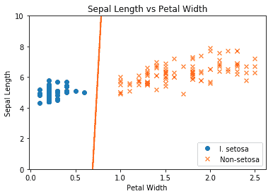
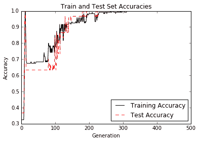
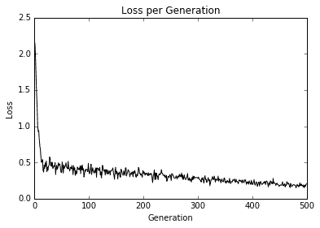
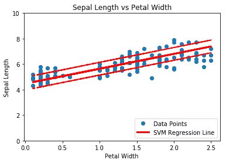
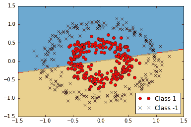
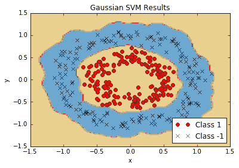
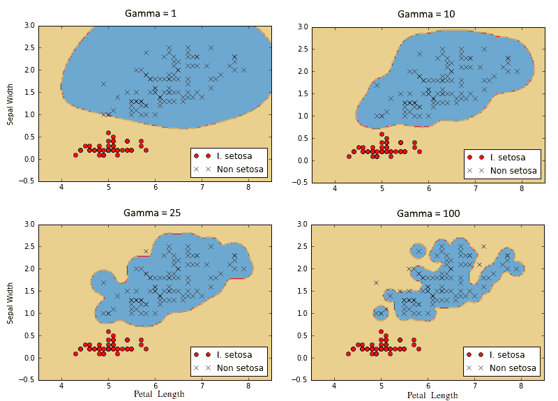

# 四、支持向量机

本章将介绍有关如何在 TensorFlow 中使用，实现和评估支持向量机（SVM）的一些重要秘籍。将涵盖以下领域：

*   使用线性 SVM
*   减少到线性回归
*   在 TensorFlow 中使用内核
*   实现非线性 SVM
*   实现多类 SVM

> 本章中先前涵盖的逻辑回归和大多数 SVM 都是二元预测变量。虽然逻辑回归试图找到最大化距离的任何分离线（概率地），但 SVM 还尝试最小化误差，同时最大化类之间的余量。通常，如果问题与训练示例相比具有大量特征，请尝试逻辑回归或线性 SVM。如果训练样本的数量较大，或者数据不是线性可分的，则可以使用具有高斯核的 SVM。

另外，请记住本章的所有代码都可以在 [Github](https://github.com/nfmcclure/tensorflow_cookbook) 和[ Packt 仓库](https://github.com/PacktPublishing/TensorFlow-Machine-Learning-Cookbook-Second-Edition)中找到。

# 介绍

SVM 是二分类的方法。基本思想是在两个类之间找到二维的线性分离线（或更多维度的超平面）。我们首先假设二进制类目标是-1 或 1，而不是先前的 0 或 1 目标。由于可能有许多行分隔两个类，我们定义最佳线性分隔符，以最大化两个类之间的距离：


图 1

给定两个可分类`o`和`x`，我们希望找到两者之间的线性分离器的等式。左侧绘图显示有许多行将两个类分开。右侧绘图显示了唯一的最大边际线。边距宽度由`2 / ||A||`给出。通过最小化`A`的 L2 范数找到该线。

我们可以编写如下超平面：


这里，`A`是我们部分斜率的向量，`x`是输入向量。最大边距的宽度可以显示为 2 除以`A`的 L2 范数。这个事实有许多证明，但是对于几何思想，求解从 2D 点到直线的垂直距离可以提供前进的动力。

对于线性可分的二进制类数据，为了最大化余量，我们最小化`A`，的 L2 范数。我们还必须将此最小值置于以下约束条件下：


前面的约束确保我们来自相应类的所有点都在分离线的同一侧。

由于并非所有数据集都是线性可分的，因此我们可以为跨越边界线的点引入损失函数。对于`n`数据点，我们引入了所谓的软边际损失函数，如下所示：


请注意，如果该点位于边距的正确一侧，则乘积`y[i](Ax[i] - b)`始终大于 1。这使得损失函数的左手项等于 0，并且对损失函数的唯一影响是余量的大小。

前面的损失函数将寻找线性可分的线，但允许穿过边缘线的点。根据`α`的值，这可以是硬度或软度量。`α`的较大值导致更加强调边距的扩大，而`α`的较小值导致模型更像是一个硬边缘，同时允许数据点跨越边距，如果需要的话。

在本章中，我们将建立一个软边界 SVM，并展示如何将其扩展到非线性情况和多个类。

# 使用线性 SVM

对于此示例，我们将从 iris 数据集创建线性分隔符。我们从前面的章节中知道，萼片长度和花瓣宽度创建了一个线性可分的二进制数据集，用于预测花是否是 I. setosa。

## 做好准备

要在 TensorFlow 中实现软可分 SVM，我们将实现特定的损失函数，如下所示：


这里，`A`是部分斜率的向量，`b`是截距，`x[i]`是输入向量，`y[i]`是实际类，（-1 或 1），`α`是软可分性正则化参数。

## 操作步骤

我们按如下方式处理秘籍：

1.  我们首先加载必要的库。这将包括用于访问虹膜数据集的`scikit-learn`数据集库。使用以下代码：

```py
import matplotlib.pyplot as plt 
import numpy as np 
import tensorflow as tf 
from sklearn import datasets 
```

> 要为此练习设置 scikit-learn，我们只需要输入`$pip install -U scikit-learn`。请注意，它也安装了 Anaconda。

1.  接下来，我们启动图会话并根据需要加载数据。请记住，我们正在加载虹膜数据集中的第一个和第四个变量，因为它们是萼片长度和萼片宽度。我们正在加载目标变量，对于 I. setosa 将取值 1，否则为-1。使用以下代码：

```py
sess = tf.Session() 
iris = datasets.load_iris() 
x_vals = np.array([[x[0], x[3]] for x in iris.data]) 
y_vals = np.array([1 if y==0 else -1 for y in iris.target])
```

1.  我们现在应该将数据集拆分为训练集和测试集。我们将评估训练和测试集的准确率。由于我们知道这个数据集是线性可分的，因此我们应该期望在两个集合上获得 100％的准确率。要拆分数据，请使用以下代码：

```py
train_indices = np.random.choice(len(x_vals), round(len(x_vals)*0.8), replace=False) 
test_indices = np.array(list(set(range(len(x_vals))) - set(train_indices))) 
x_vals_train = x_vals[train_indices] 
x_vals_test = x_vals[test_indices] 
y_vals_train = y_vals[train_indices] 
y_vals_test = y_vals[test_indices] 
```

1.  接下来，我们设置批量大小，占位符和模型变量。值得一提的是，使用这种 SVM 算法，我们需要非常大的批量大小来帮助收敛。我们可以想象，对于非常小的批量大小，最大边际线会略微跳跃。理想情况下，我们也会慢慢降低学习率，但现在这已经足够了。此外，`A`变量将采用 2x1 形状，因为我们有两个预测变量：萼片长度和花瓣宽度。要进行此设置，我们使用以下代码：

```py
batch_size = 100 

x_data = tf.placeholder(shape=[None, 2], dtype=tf.float32) 
y_target = tf.placeholder(shape=[None, 1], dtype=tf.float32) 

A = tf.Variable(tf.random_normal(shape=[2,1])) 
b = tf.Variable(tf.random_normal(shape=[1,1])) 
```

1.  我们现在声明我们的模型输出。对于正确分类的点，如果目标是 I. setosa，则返回大于或等于 1 的数字，否则返回小于或等于-1。模型输出使用以下代码：

```py
model_output = tf.subtract(tf.matmul(x_data, A), b) 
```

1.  接下来，我们将汇总并声明必要的组件以获得最大的保证金损失。首先，我们将声明一个计算向量的 L2 范数的函数。然后，我们添加 margin 参数。然后我们宣布我们的分类损失并将这两个术语加在一起。使用以下代码：

```py
l2_norm = tf.reduce_sum(tf.square(A)) 
alpha = tf.constant([0.1]) 
classification_term = tf.reduce_mean(tf.maximum(0., tf.subtract(1., tf.multiply(model_output, y_target)))) 

loss = tf.add(classification _term, tf.multiply(alpha, l2_norm)) 
```

1.  现在，我们声明我们的预测和准确率函数，以便我们可以评估训练集和测试集的准确率，如下所示：

```py
prediction = tf.sign(model_output) 
accuracy = tf.reduce_mean(tf.cast(tf.equal(prediction, y_target), tf.float32)) 
```

1.  在这里，我们将声明我们的优化函数并初始化我们的模型变量;我们在以下代码中执行此操作：

```py
my_opt = tf.train.GradientDescentOptimizer(0.01) 
train_step = my_opt.minimize(loss) 

init = tf.global_variables_initializer() 
sess.run(init) 
```

1.  我们现在可以开始我们的训练循环，记住我们想要在训练和测试集上记录我们的损失和训练准确率，如下所示：

```py
loss_vec = [] 
train_accuracy = [] 
test_accuracy = [] 
for i in range(500): 
   rand_index = np.random.choice(len(x_vals_train), size=batch_size) 
   rand_x = x_vals_train[rand_index] 
    rand_y = np.transpose([y_vals_train[rand_index]]) 
    sess.run(train_step, feed_dict={x_data: rand_x, y_target: rand_y}) 

    temp_loss = sess.run(loss, feed_dict={x_data: rand_x, y_target: rand_y}) 
    loss_vec.append(temp_loss) 

    train_acc_temp = sess.run(accuracy, feed_dict={x_data: x_vals_train, y_target: np.transpose([y_vals_train])}) 
    train_accuracy.append(train_acc_temp) 

    test_acc_temp = sess.run(accuracy, feed_dict={x_data: x_vals_test, y_target: np.transpose([y_vals_test])}) 
    test_accuracy.append(test_acc_temp) 

    if (i+1)%100==0: 
        print('Step #' + str(i+1) + ' A = ' + str(sess.run(A)) + ' b = ' + str(sess.run(b))) 
        print('Loss = ' + str(temp_loss))
```

1.  训练期间脚本的输出应如下所示：

```py
Step #100 A = [[-0.10763293] 
 [-0.65735245]] b = [[-0.68752676]] 
Loss = [ 0.48756418] 
Step #200 A = [[-0.0650763 ] 
 [-0.89443302]] b = [[-0.73912662]] 
Loss = [ 0.38910741] 
Step #300 A = [[-0.02090022] 
 [-1.12334013]] b = [[-0.79332656]] 
Loss = [ 0.28621092] 
Step #400 A = [[ 0.03189624] 
 [-1.34912157]] b = [[-0.8507266]] 
Loss = [ 0.22397576] 
Step #500 A = [[ 0.05958777] 
 [-1.55989814]] b = [[-0.9000265]] 
Loss = [ 0.20492229] 
```

1.  为了绘制输出（拟合，损失和精度），我们必须提取系数并将`x`值分成 I. setosa 和 Non-setosa，如下所示：

```py
[[a1], [a2]] = sess.run(A) 
[[b]] = sess.run(b) 
slope = -a2/a1 
y_intercept = b/a1 

x1_vals = [d[1] for d in x_vals] 

best_fit = [] 
for i in x1_vals: 
    best_fit.append(slope*i+y_intercept) 

setosa_x = [d[1] for i,d in enumerate(x_vals) if y_vals[i]==1] 
setosa_y = [d[0] for i,d in enumerate(x_vals) if y_vals[i]==1] 
not_setosa_x = [d[1] for i,d in enumerate(x_vals) if y_vals[i]==-1] 
not_setosa_y = [d[0] for i,d in enumerate(x_vals) if y_vals[i]==-1] 
```

1.  以下是使用线性分离器拟合，精度和损耗绘制数据的代码：

```py
plt.plot(setosa_x, setosa_y, 'o', label='I. setosa') 
plt.plot(not_setosa_x, not_setosa_y, 'x', label='Non-setosa') 
plt.plot(x1_vals, best_fit, 'r-', label='Linear Separator', linewidth=3) 
plt.ylim([0, 10]) 
plt.legend(loc='lower right') 
plt.title('Sepal Length vs Petal Width') 
plt.xlabel('Petal Width') 
plt.ylabel('Sepal Length') 
plt.show() 

plt.plot(train_accuracy, 'k-', label='Training Accuracy') 
plt.plot(test_accuracy, 'r--', label='Test Accuracy') 
plt.title('Train and Test Set Accuracies') 
plt.xlabel('Generation') 
plt.ylabel('Accuracy') 
plt.legend(loc='lower right') 
plt.show() 

plt.plot(loss_vec, 'k-') 
plt.title('Loss per Generation') 
plt.xlabel('Generation') 
plt.ylabel('Loss') 
plt.show() 
```

> 以这种方式使用 TensorFlow 来实现 SVD 算法可能导致每次运行的结果略有不同。其原因包括随机训练/测试集拆分以及每个训练批次中不同批次点的选择。此外，在每一代之后慢慢降低学习率是理想的。

得到的图如下：



图 2：最终线性 SVM 与绘制的两个类别拟合



图 3：迭代测试和训练集精度;我们确实获得 100％的准确率，因为这两个类是线性可分的



图 4：超过 500 次迭代的最大边际损失图

## 工作原理

在本文中，我们已经证明使用最大边际损失函数可以实现线性 SVD 模型。

# 简化为线性回归

SVM 可用于拟合线性回归。在本节中，我们将探讨如何使用 TensorFlow 执行此操作。

## 做好准备

可以将相同的最大边际概念应用于拟合线性回归。我们可以考虑最大化包含最多（`x`，`y`）点的边距，而不是最大化分隔类的边距。为了说明这一点，我们将使用相同的虹膜数据集，并表明我们可以使用此概念来拟合萼片长度和花瓣宽度之间的线。

相应的损失函数类似于：


这里，`ε`是边距宽度的一半，如果一个点位于该区域，则损失等于 0。

## 操作步骤

我们按如下方式处理秘籍：

1.  首先，我们加载必要的库，启动图，然后加载虹膜数据集。之后，我们将数据集拆分为训练集和测试集，以显示两者的损失。使用以下代码：

```py
import matplotlib.pyplot as plt 
import numpy as np 
import tensorflow as tf 
from sklearn import datasets 
sess = tf.Session() 
iris = datasets.load_iris() 
x_vals = np.array([x[3] for x in iris.data]) 
y_vals = np.array([y[0] for y in iris.data]) 
train_indices = np.random.choice(len(x_vals), round(len(x_vals)*0.8), replace=False) 
test_indices = np.array(list(set(range(len(x_vals))) - set(train_indices))) 
x_vals_train = x_vals[train_indices] 
x_vals_test = x_vals[test_indices] 
y_vals_train = y_vals[train_indices] 
y_vals_test = y_vals[test_indices]
```

> 对于此示例，我们将数据拆分为训练集和测试集。将数据拆分为三个数据集也很常见，其中包括验证集。我们可以使用此验证集来验证我们在训练它们时不会过拟合模型。

1.  让我们声明我们的批量大小，占位符和变量，并创建我们的线性模型，如下所示：

```py
batch_size = 50 

x_data = tf.placeholder(shape=[None, 1], dtype=tf.float32) 
y_target = tf.placeholder(shape=[None, 1], dtype=tf.float32) 

A = tf.Variable(tf.random_normal(shape=[1,1])) 
b = tf.Variable(tf.random_normal(shape=[1,1])) 

model_output = tf.add(tf.matmul(x_data, A), b) 
```

1.  现在，我们宣布我们的损失函数。如前文所述，损失函数实现为`ε = 0.5`。请记住，epsilon 是我们的损失函数的一部分，它允许软边距而不是硬边距：

```py
epsilon = tf.constant([0.5]) 
loss = tf.reduce_mean(tf.maximum(0., tf.subtract(tf.abs(tf.subtract(model_output, y_target)), epsilon))) 
```

1.  我们创建一个优化器并接下来初始化我们的变量，如下所示：

```py
my_opt = tf.train.GradientDescentOptimizer(0.075) 
train_step = my_opt.minimize(loss) 

init = tf.global_variables_initializer() 
sess.run(init) 
```

1.  现在，我们迭代 200 次训练迭代并保存训练和测试损失以便以后绘图：

```py
train_loss = [] 
test_loss = [] 
for i in range(200): 
    rand_index = np.random.choice(len(x_vals_train), size=batch_size) 
    rand_x = np.transpose([x_vals_train[rand_index]]) 
    rand_y = np.transpose([y_vals_train[rand_index]]) 
    sess.run(train_step, feed_dict={x_data: rand_x, y_target: rand_y}) 

    temp_train_loss = sess.run(loss, feed_dict={x_data: np.transpose([x_vals_train]), y_target: np.transpose([y_vals_train])}) 
    train_loss.append(temp_train_loss) 

    temp_test_loss = sess.run(loss, feed_dict={x_data: np.transpose([x_vals_test]), y_target: np.transpose([y_vals_test])}) 
    test_loss.append(temp_test_loss) 
    if (i+1)%50==0: 
        print('-----------') 
        print('Generation: ' + str(i)) 
        print('A = ' + str(sess.run(A)) + ' b = ' + str(sess.run(b))) 
        print('Train Loss = ' + str(temp_train_loss)) 
        print('Test Loss = ' + str(temp_test_loss)) 
```

1.  这导致以下输出：

```py
Generation: 50 
A = [[ 2.20651722]] b = [[ 2.71290684]] 
Train Loss = 0.609453 
Test Loss = 0.460152 
----------- 
Generation: 100 
A = [[ 1.6440177]] b = [[ 3.75240564]] 
Train Loss = 0.242519 
Test Loss = 0.208901 
----------- 
Generation: 150 
A = [[ 1.27711761]] b = [[ 4.3149066]] 
Train Loss = 0.108192 
Test Loss = 0.119284 
----------- 
Generation: 200 
A = [[ 1.05271816]] b = [[ 4.53690529]] 
Train Loss = 0.0799957 
Test Loss = 0.107551 
```

1.  我们现在可以提取我们找到的系数，并获得最佳拟合线的值。出于绘图目的，我们也将获得边距的值。使用以下代码：

```py
[[slope]] = sess.run(A) 
[[y_intercept]] = sess.run(b) 
[width] = sess.run(epsilon) 

best_fit = [] 
best_fit_upper = [] 
best_fit_lower = [] 
for i in x_vals: 
  best_fit.append(slope*i+y_intercept) 
  best_fit_upper.append(slope*i+y_intercept+width) 
  best_fit_lower.append(slope*i+y_intercept-width) 
```

1.  最后，这里是用拟合线和训练测试损失绘制数据的代码：

```py
plt.plot(x_vals, y_vals, 'o', label='Data Points') 
plt.plot(x_vals, best_fit, 'r-', label='SVM Regression Line', linewidth=3) 
plt.plot(x_vals, best_fit_upper, 'r--', linewidth=2) 
plt.plot(x_vals, best_fit_lower, 'r--', linewidth=2) 
plt.ylim([0, 10]) 
plt.legend(loc='lower right') 
plt.title('Sepal Length vs Petal Width') 
plt.xlabel('Petal Width') 
plt.ylabel('Sepal Length') 
plt.show() 
plt.plot(train_loss, 'k-', label='Train Set Loss') 
plt.plot(test_loss, 'r--', label='Test Set Loss') 
plt.title('L2 Loss per Generation') 
plt.xlabel('Generation') 
plt.ylabel('L2 Loss') 
plt.legend(loc='upper right') 
plt.show() 
```

上述代码的图如下：



图 5：虹膜数据上有 0.5 个边缘的 SVM 回归（萼片长度与花瓣宽度）

以下是训练迭代中的训练和测试损失：


图 6：训练和测试集上每代的 SVM 回归损失

## 工作原理

直觉上，我们可以将 SVM 回归看作是一个函数，试图尽可能多地在`2ε`宽度范围内拟合点。该线的拟合对该参数有些敏感。如果我们选择太小的 epsilon，算法将无法适应边距中的许多点。如果我们选择太大的 epsilon，将会有许多行能够适应边距中的所有数据点。我们更喜欢较小的 epsilon，因为距离边缘较近的点比较远的点贡献较少的损失。

# 在 TensorFlow 中使用内核

先前的 SVM 使用线性可分数据。如果我们分离非线性数据，我们可以改变将线性分隔符投影到数据上的方式。这是通过更改 SVM 损失函数中的内核来完成的。在本章中，我们将介绍如何更改内核并分离非线性可分离数据。

## 做好准备

在本文中，我们将激励支持向量机中内核的使用。在线性 SVM 部分，我们用特定的损失函数求解了软边界。这种方法的另一种方法是解决所谓的优化问题的对偶。可以证明线性 SVM 问题的对偶性由以下公式给出：


对此，以下适用：


这里，模型中的变量将是`b`向量。理想情况下，此向量将非常稀疏，仅对我们数据集的相应支持向量采用接近 1 和-1 的值。我们的数据点向量由`x[i]`表示，我们的目标（1 或 -1）`y[i]`表示。

前面等式中的内核是点积`x[i] · y[j]`，它给出了线性内核。该内核是一个方形矩阵，填充了数据点`i, j`的点积。

我们可以将更复杂的函数扩展到更高的维度，而不是仅仅在数据点之间进行点积，而在这些维度中，类可以是线性可分的。这似乎是不必要的复杂，但我们可以选择一个具有以下属性的函数`k`：


这里`, k`被称为核函数。更常见的内核是使用高斯内核（也称为径向基函数内核或 RBF 内核）。该内核用以下等式描述：


为了对这个内核进行预测，比如说`p[i]`，我们只需在内核中的相应方程中用预测点替换，如下所示：


在本节中，我们将讨论如何实现高斯内核。我们还将在适当的位置记下在何处替换实现线性内核。我们将使用的数据集将手动创建，以显示高斯内核更适合在线性内核上使用的位置。

## 操作步骤

我们按如下方式处理秘籍：

1.  首先，我们加载必要的库并启动图会话，如下所示：

```py
import matplotlib.pyplot as plt 
import numpy as np 
import tensorflow as tf 
from sklearn import datasets 
sess = tf.Session() 
```

1.  现在，我们生成数据。我们将生成的数据将是两个同心数据环;每个戒指都属于不同的阶级。我们必须确保类只有-1 或 1。然后我们将数据分成每个类的`x`和`y`值以用于绘图目的。为此，请使用以下代码：

```py
(x_vals, y_vals) = datasets.make_circles(n_samples=500, factor=.5, noise=.1) 
y_vals = np.array([1 if y==1 else -1 for y in y_vals]) 
class1_x = [x[0] for i,x in enumerate(x_vals) if y_vals[i]==1] 
class1_y = [x[1] for i,x in enumerate(x_vals) if y_vals[i]==1] 
class2_x = [x[0] for i,x in enumerate(x_vals) if y_vals[i]==-1] 
class2_y = [x[1] for i,x in enumerate(x_vals) if y_vals[i]==-1]
```

1.  接下来，我们声明批量大小和占位符，并创建我们的模型变量`b`。对于 SVM，我们倾向于需要更大的批量大小，因为我们需要一个非常稳定的模型，该模型在每次训练生成时都不会波动很大。另请注意，我们为预测点添加了额外的占位符。为了可视化结果，我们将创建一个颜色网格，以查看哪些区域最后属于哪个类。我们这样做如下：

```py
batch_size = 250 
x_data = tf.placeholder(shape=[None, 2], dtype=tf.float32) 
y_target = tf.placeholder(shape=[None, 1], dtype=tf.float32) 
prediction_grid = tf.placeholder(shape=[None, 2], dtype=tf.float32) 
b = tf.Variable(tf.random_normal(shape=[1,batch_size])) 
```

1.  我们现在将创建高斯内核。该内核可以表示为矩阵运算，如下所示：

```py
gamma = tf.constant(-50.0) 
dist = tf.reduce_sum(tf.square(x_data), 1) 
dist = tf.reshape(dist, [-1,1]) 
sq_dists = tf.add(tf.subtract(dist, tf.multiply(2., tf.matmul(x_data, tf.transpose(x_data)))), tf.transpose(dist)) 
my_kernel = tf.exp(tf.multiply(gamma, tf.abs(sq_dists)))  
```

> 注意`add`和`subtract`操作的`sq_dists`行中广播的使用。 另外，请注意线性内核可以表示为`my_kernel = tf.matmul(x_data, tf.transpose(x_data))`。

1.  现在，我们宣布了本秘籍中之前所述的双重问题。最后，我们将使用`tf.negative()`函数最小化损失函数的负值，而不是最大化。我们使用以下代码完成此任务：

```py
model_output = tf.matmul(b, my_kernel) 
first_term = tf.reduce_sum(b) 
b_vec_cross = tf.matmul(tf.transpose(b), b) 
y_target_cross = tf.matmul(y_target, tf.transpose(y_target)) 
second_term = tf.reduce_sum(tf.multiply(my_kernel, tf.multiply(b_vec_cross, y_target_cross))) 
loss = tf.negative(tf.subtract(first_term, second_term))
```

1.  我们现在创建预测和准确率函数。首先，我们必须创建一个预测内核，类似于步骤 4，但是我们拥有带有预测数据的点的核心，而不是点的内核。然后预测是模型输出的符号。这实现如下：

```py
rA = tf.reshape(tf.reduce_sum(tf.square(x_data), 1),[-1,1]) 
rB = tf.reshape(tf.reduce_sum(tf.square(prediction_grid), 1),[-1,1]) 
pred_sq_dist = tf.add(tf.subtract(rA, tf.multiply(2., tf.matmul(x_data, tf.transpose(prediction_grid)))), tf.transpose(rB)) 
pred_kernel = tf.exp(tf.multiply(gamma, tf.abs(pred_sq_dist))) 

prediction_output = tf.matmul(tf.multiply(tf.transpose(y_target),b), pred_kernel) 
prediction = tf.sign(prediction_output-tf.reduce_mean(prediction_output)) 
accuracy = tf.reduce_mean(tf.cast(tf.equal(tf.squeeze(prediction), tf.squeeze(y_target)), tf.float32)) 
```

> 为了实现线性预测内核，我们可以编写`pred_kernel = tf.matmul(x_data, tf.transpose(prediction_grid))`。

1.  现在，我们可以创建一个优化函数并初始化所有变量，如下所示：

```py
my_opt = tf.train.GradientDescentOptimizer(0.001) 
train_step = my_opt.minimize(loss) 
init = tf.global_variables_initializer() 
sess.run(init) 
```

1.  接下来，我们开始训练循环。我们将记录每代的损耗向量和批次精度。当我们运行准确率时，我们必须放入所有三个占位符，但我们输入`x`数据两次以获得对点的预测，如下所示：

```py
loss_vec = [] 
batch_accuracy = [] 
for i in range(500): 
    rand_index = np.random.choice(len(x_vals), size=batch_size) 
    rand_x = x_vals[rand_index] 
    rand_y = np.transpose([y_vals[rand_index]]) 
    sess.run(train_step, feed_dict={x_data: rand_x, y_target: rand_y}) 

    temp_loss = sess.run(loss, feed_dict={x_data: rand_x, y_target: rand_y}) 
    loss_vec.append(temp_loss) 

    acc_temp = sess.run(accuracy, feed_dict={x_data: rand_x, 
                                             y_target: rand_y, 
                                             prediction_grid:rand_x}) 
    batch_accuracy.append(acc_temp) 

    if (i+1)%100==0: 
        print('Step #' + str(i+1)) 
        print('Loss = ' + str(temp_loss)) 
```

1.  这导致以下输出：

```py
Step #100 
Loss = -28.0772 
Step #200 
Loss = -3.3628 
Step #300 
Loss = -58.862 
Step #400 
Loss = -75.1121 
Step #500 
Loss = -84.8905 
```

1.  为了查看整个空间的输出类，我们将在系统中创建一个预测点网格，并对所有这些预测点进行预测，如下所示：

```py
x_min, x_max = x_vals[:, 0].min() - 1, x_vals[:, 0].max() + 1 
y_min, y_max = x_vals[:, 1].min() - 1, x_vals[:, 1].max() + 1 
xx, yy = np.meshgrid(np.arange(x_min, x_max, 0.02), 
                     np.arange(y_min, y_max, 0.02)) 
grid_points = np.c_[xx.ravel(), yy.ravel()] 
[grid_predictions] = sess.run(prediction, feed_dict={x_data: x_vals, 
                                                   y_target: np.transpose([y_vals]), 
                                                   prediction_grid: grid_points}) 
grid_predictions = grid_predictions.reshape(xx.shape) 
```

1.  以下是绘制结果，批次准确率和损失的代码：

```py
plt.contourf(xx, yy, grid_predictions, cmap=plt.cm.Paired, alpha=0.8) 
plt.plot(class1_x, class1_y, 'ro', label='Class 1') 
plt.plot(class2_x, class2_y, 'kx', label='Class -1') 
plt.legend(loc='lower right') 
plt.ylim([-1.5, 1.5]) 
plt.xlim([-1.5, 1.5]) 
plt.show() 

plt.plot(batch_accuracy, 'k-', label='Accuracy') 
plt.title('Batch Accuracy') 
plt.xlabel('Generation') 
plt.ylabel('Accuracy') 
plt.legend(loc='lower right') 
plt.show() 

plt.plot(loss_vec, 'k-') 
plt.title('Loss per Generation') 
plt.xlabel('Generation') 
plt.ylabel('Loss') 
plt.show() 
```

为了简洁起见，我们将仅显示结果图，但我们也可以单独运行绘图代码并查看损失和准确率。

以下屏幕截图说明了线性可分离拟合对我们的非线性数据有多糟糕：



图 7：非线性可分离数据上的线性 SVM

以下屏幕截图显示了高斯内核可以更好地拟合非线性数据：

Figure 8: Non-linear SVM with Gaussian kernel results on non-linear ring data

如果我们使用高斯内核来分离我们的非线性环数据，我们会得到更好的拟合。

## 工作原理

有两个重要的代码需要了解：我们如何实现内核，以及我们如何为 SVM 双优化问题实现损失函数。我们已经展示了如何实现线性和高斯核，并且高斯核可以分离非线性数据集。

我们还应该提到另一个参数，即高斯核中的伽马值。此参数控制影响点对分离曲率的影响程度。通常选择小值，但它在很大程度上取决于数据集。理想情况下，使用交叉验证等统计技术选择此参数。

> 对于新点的预测/评估，我们使用以下命令：`sess.run(prediction, feed_dict:{x_data: x_vals, y_data: np.transpose([y_vals])})`。此评估必须包括原始数据集（`x_vals`和`y_vals`），因为 SVM 是使用支持向量定义的，由哪些点指定在边界上或不是。

## 更多

如果我们这样选择，我们可以实现更多内核。以下是一些更常见的非线性内核列表：

*   多项式齐次核：


*   多项式非均匀内核：


*   双曲正切内核：


# 实现非线性 SVM

对于此秘籍，我们将应用非线性内核来拆分数据集。

## 做好准备

在本节中，我们将在实际数据上实现前面的高斯核 SVM。我们将加载虹膜数据集并为 I. setosa 创建分类器（与非 setosa 相比）。我们将看到各种伽马值对分类的影响。

## 操作步骤

我们按如下方式处理秘籍：

1.  我们首先加载必要的库，其中包括`scikit-learn`数据集，以便我们可以加载虹膜数据。然后，我们将开始图会话。使用以下代码：

```py
import matplotlib.pyplot as plt 
import numpy as np 
import tensorflow as tf 
from sklearn import datasets 
sess = tf.Session() 
```

1.  接下来，我们将加载虹膜数据，提取萼片长度和花瓣宽度，并分离每个类的`x`和`y`值（以便以后绘图），如下所示：

```py
iris = datasets.load_iris() 
x_vals = np.array([[x[0], x[3]] for x in iris.data]) 
y_vals = np.array([1 if y==0 else -1 for y in iris.target]) 
class1_x = [x[0] for i,x in enumerate(x_vals) if y_vals[i]==1] 
class1_y = [x[1] for i,x in enumerate(x_vals) if y_vals[i]==1] 
class2_x = [x[0] for i,x in enumerate(x_vals) if y_vals[i]==-1] 
class2_y = [x[1] for i,x in enumerate(x_vals) if y_vals[i]==-1] 
```

1.  现在，我们声明我们的批量大小（首选大批量），占位符和模型变量`b`，如下所示：

```py
batch_size = 100 

x_data = tf.placeholder(shape=[None, 2], dtype=tf.float32) 
y_target = tf.placeholder(shape=[None, 1], dtype=tf.float32) 
prediction_grid = tf.placeholder(shape=[None, 2], dtype=tf.float32) 

b = tf.Variable(tf.random_normal(shape=[1,batch_size]))
```

1.  接下来，我们声明我们的高斯内核。这个内核依赖于伽马值，我们将在本文后面的各个伽玛值对分类的影响进行说明。使用以下代码：

```py
gamma = tf.constant(-10.0) 
dist = tf.reduce_sum(tf.square(x_data), 1) 
dist = tf.reshape(dist, [-1,1]) 
sq_dists = tf.add(tf.subtract(dist, tf.multiply(2., tf.matmul(x_data, tf.transpose(x_data)))), tf.transpose(dist)) 
my_kernel = tf.exp(tf.multiply(gamma, tf.abs(sq_dists))) 
# We now compute the loss for the dual optimization problem, as follows: 
model_output = tf.matmul(b, my_kernel) 
first_term = tf.reduce_sum(b) 
b_vec_cross = tf.matmul(tf.transpose(b), b) 
y_target_cross = tf.matmul(y_target, tf.transpose(y_target)) 
second_term = tf.reduce_sum(tf.multiply(my_kernel, tf.multiply(b_vec_cross, y_target_cross))) 
loss = tf.negative(tf.subtract(first_term, second_term)) 
```

1.  为了使用 SVM 执行预测，我们必须创建预测内核函数。之后，我们还会声明一个准确率计算，它只是使用以下代码正确分类的点的百分比：

```py
rA = tf.reshape(tf.reduce_sum(tf.square(x_data), 1),[-1,1]) 
rB = tf.reshape(tf.reduce_sum(tf.square(prediction_grid), 1),[-1,1]) 
pred_sq_dist = tf.add(tf.subtract(rA, tf.mul(2., tf.matmul(x_data, tf.transpose(prediction_grid)))), tf.transpose(rB)) 
pred_kernel = tf.exp(tf.multiply(gamma, tf.abs(pred_sq_dist))) 

prediction_output = tf.matmul(tf.multiply(tf.transpose(y_target),b), pred_kernel) 
prediction = tf.sign(prediction_output-tf.reduce_mean(prediction_output)) 
accuracy = tf.reduce_mean(tf.cast(tf.equal(tf.squeeze(prediction), tf.squeeze(y_target)), tf.float32)) 
```

1.  接下来，我们声明我们的优化函数并初始化变量，如下所示：

```py
my_opt = tf.train.GradientDescentOptimizer(0.01) 
train_step = my_opt.minimize(loss) 
init = tf.initialize_all_variables() 
sess.run(init)
```

1.  现在，我们可以开始训练循环了。我们运行循环 300 次迭代并存储损失值和批次精度。为此，我们使用以下实现：

```py
loss_vec = [] 
batch_accuracy = [] 
for i in range(300): 
    rand_index = np.random.choice(len(x_vals), size=batch_size) 
    rand_x = x_vals[rand_index] 
    rand_y = np.transpose([y_vals[rand_index]]) 
    sess.run(train_step, feed_dict={x_data: rand_x, y_target: rand_y}) 

    temp_loss = sess.run(loss, feed_dict={x_data: rand_x, y_target: rand_y}) 
    loss_vec.append(temp_loss) 

    acc_temp = sess.run(accuracy, feed_dict={x_data: rand_x, 
                                             y_target: rand_y, 
                                             prediction_grid:rand_x}) 
    batch_accuracy.append(acc_temp) 
```

1.  为了绘制决策边界，我们将创建`x`，`y`点的网格并评估我们在所有这些点上创建的预测函数，如下所示：

```py
x_min, x_max = x_vals[:, 0].min() - 1, x_vals[:, 0].max() + 1 
y_min, y_max = x_vals[:, 1].min() - 1, x_vals[:, 1].max() + 1 
xx, yy = np.meshgrid(np.arange(x_min, x_max, 0.02), 
                     np.arange(y_min, y_max, 0.02)) 
grid_points = np.c_[xx.ravel(), yy.ravel()] 
[grid_predictions] = sess.run(prediction, feed_dict={x_data: x_vals, 
                                                   y_target: np.transpose([y_vals]), 
                                                   prediction_grid: grid_points}) 
grid_predictions = grid_predictions.reshape(xx.shape) 
```

1.  为简洁起见，我们只展示如何用决策边界绘制点。有关 gamma 的图和效果，请参阅本秘籍的下一部分。使用以下代码：

```py
plt.contourf(xx, yy, grid_predictions, cmap=plt.cm.Paired, alpha=0.8) 
plt.plot(class1_x, class1_y, 'ro', label='I. setosa') 
plt.plot(class2_x, class2_y, 'kx', label='Non-setosa') 
plt.title('Gaussian SVM Results on Iris Data') 
plt.xlabel('Petal Length') 
plt.ylabel('Sepal Width') 
plt.legend(loc='lower right') 
plt.ylim([-0.5, 3.0]) 
plt.xlim([3.5, 8.5]) 
plt.show() 
```

## 工作原理

以下是对四种不同伽玛值（1,10,25 和 100）的 I. setosa 结果的分类。注意伽玛值越高，每个单独点对分类边界的影响越大：



图 9：使用具有四个不同伽马值的高斯核 SVM 的 I. setosa 的分类结果

# 实现多类 SVM

我们还可以使用 SVM 对多个类进行分类，而不仅仅是两个类。在本文中，我们将使用多类 SVM 对虹膜数据集中的三种类型的花进行分类。

## 做好准备

通过设计，SVM 算法是二元分类器。但是，有一些策略可以让他们在多个类上工作。两种主要策略称为“一对一”，“一对一”。

一对一是一种策略，其中为每个可能的类对创建二分类器。然后，对具有最多投票的类的点进行预测。这可能在计算上很难，因为我们必须为`k`类创建`k!/(k - 2)!2!`个分类器。

实现多类分类器的另一种方法是执行一对一策略，我们为`k`类的每个类创建一个分类器。点的预测类将是创建最大 SVM 边距的类。这是我们将在本节中实现的策略。

在这里，我们将加载虹膜数据集并使用高斯内核执行多类非线性 SVM。虹膜数据集是理想的，因为有三个类（setosa，virginica 和 versicolor）。我们将为每个类创建三个高斯核 SVM，并预测存在最高边界的点。

## 操作步骤

我们按如下方式处理秘籍：

1.  首先，我们加载我们需要的库并启动图，如下所示：

```py
import matplotlib.pyplot as plt 
import numpy as np 
import tensorflow as tf 
from sklearn import datasets 
sess = tf.Session()
```

1.  接下来，我们将加载虹膜数据集并拆分每个类的目标。我们将仅使用萼片长度和花瓣宽度来说明，因为我们希望能够绘制输出。我们还将每个类的`x`和`y`值分开，以便最后进行绘图。使用以下代码：

```py
iris = datasets.load_iris() 
x_vals = np.array([[x[0], x[3]] for x in iris.data]) 
y_vals1 = np.array([1 if y==0 else -1 for y in iris.target]) 
y_vals2 = np.array([1 if y==1 else -1 for y in iris.target]) 
y_vals3 = np.array([1 if y==2 else -1 for y in iris.target]) 
y_vals = np.array([y_vals1, y_vals2, y_vals3]) 
class1_x = [x[0] for i,x in enumerate(x_vals) if iris.target[i]==0] 
class1_y = [x[1] for i,x in enumerate(x_vals) if iris.target[i]==0] 
class2_x = [x[0] for i,x in enumerate(x_vals) if iris.target[i]==1] 
class2_y = [x[1] for i,x in enumerate(x_vals) if iris.target[i]==1] 
class3_x = [x[0] for i,x in enumerate(x_vals) if iris.target[i]==2] 
class3_y = [x[1] for i,x in enumerate(x_vals) if iris.target[i]==2] 
```

1.  与实现非线性 SVM 秘籍相比，我们在此示例中所做的最大改变是，许多维度将发生变化（我们现在有三个分类器而不是一个）。我们还将利用矩阵广播和重塑技术一次计算所有三个 SVM。由于我们一次性完成这一操作，我们的`y_target`占位符现在具有`[3, None]`的尺寸，我们的模型变量`b`将被初始化为`[3, batch_size]`。使用以下代码：

```py
batch_size = 50 

x_data = tf.placeholder(shape=[None, 2], dtype=tf.float32) 
y_target = tf.placeholder(shape=[3, None], dtype=tf.float32) 
prediction_grid = tf.placeholder(shape=[None, 2], dtype=tf.float32) 

b = tf.Variable(tf.random_normal(shape=[3,batch_size])) 
```

1.  接下来，我们计算高斯核。由于这仅取决于输入的 x 数据，因此该代码不会改变先前的秘籍。使用以下代码：

```py
gamma = tf.constant(-10.0) 
dist = tf.reduce_sum(tf.square(x_data), 1) 
dist = tf.reshape(dist, [-1,1]) 
sq_dists = tf.add(tf.subtract(dist, tf.multiply(2., tf.matmul(x_data, tf.transpose(x_data)))), tf.transpose(dist)) 
my_kernel = tf.exp(tf.multiply(gamma, tf.abs(sq_dists)))
```

1.  一个重大变化是我们将进行批量矩阵乘法。我们将最终得到三维矩阵，我们将希望在第三个索引上广播矩阵乘法。我们没有为此设置数据和目标矩阵。为了使`x^T · x`等操作跨越额外维度，我们创建一个函数来扩展这样的矩阵，将矩阵重新整形为转置，然后在额外维度上调用 TensorFlow 的`batch_matmul`。使用以下代码：

```py
def reshape_matmul(mat): 
    v1 = tf.expand_dims(mat, 1) 
    v2 = tf.reshape(v1, [3, batch_size, 1]) 
    return tf.batch_matmul(v2, v1)
```

1.  创建此函数后，我们现在可以计算双重损失函数，如下所示：

```py
model_output = tf.matmul(b, my_kernel) 
first_term = tf.reduce_sum(b) 
b_vec_cross = tf.matmul(tf.transpose(b), b) 
y_target_cross = reshape_matmul(y_target) 

second_term = tf.reduce_sum(tf.multiply(my_kernel, tf.multiply(b_vec_cross, y_target_cross)),[1,2]) 
loss = tf.reduce_sum(tf.negative(tf.subtract(first_term, second_term))) 
```

1.  现在，我们可以创建预测内核。请注意，我们必须小心`reduce_sum`函数并且不要在所有三个 SVM 预测中减少，因此我们必须告诉 TensorFlow 不要用第二个索引参数对所有内容求和。使用以下代码：

```py
rA = tf.reshape(tf.reduce_sum(tf.square(x_data), 1),[-1,1]) 
rB = tf.reshape(tf.reduce_sum(tf.square(prediction_grid), 1),[-1,1]) 
pred_sq_dist = tf.add(tf.subtract(rA, tf.multiply(2., tf.matmul(x_data, tf.transpose(prediction_grid)))), tf.transpose(rB)) 
pred_kernel = tf.exp(tf.multiply(gamma, tf.abs(pred_sq_dist))) 
```

1.  当我们完成预测内核时，我们可以创建预测。这里的一个重大变化是预测不是输出的`sign()`。由于我们正在实现一对一策略，因此预测是具有最大输出的分类器。为此，我们使用 TensorFlow 的内置`argmax()`函数，如下所示：

```py
prediction_output = tf.matmul(tf.mul(y_target,b), pred_kernel) 
prediction = tf.arg_max(prediction_output-tf.expand_dims(tf.reduce_mean(prediction_output,1), 1), 0) 
accuracy = tf.reduce_mean(tf.cast(tf.equal(prediction, tf.argmax(y_target,0)), tf.float32)) 
```

1.  现在我们已经拥有了内核，损失和预测函数，我们只需要声明我们的优化函数并初始化我们的变量，如下所示：

```py
my_opt = tf.train.GradientDescentOptimizer(0.01) 
train_step = my_opt.minimize(loss) 
init = tf.global_variables_initializer() 
sess.run(init)
```

1.  该算法收敛速度相对较快，因此我们不必运行训练循环超过 100 次迭代。我们使用以下代码执行此操作：

```py
loss_vec = [] 
batch_accuracy = [] 
for i in range(100): 
    rand_index = np.random.choice(len(x_vals), size=batch_size) 
    rand_x = x_vals[rand_index] 
    rand_y = y_vals[:,rand_index] 
    sess.run(train_step, feed_dict={x_data: rand_x, y_target: rand_y}) 

    temp_loss = sess.run(loss, feed_dict={x_data: rand_x, y_target: rand_y}) 
    loss_vec.append(temp_loss) 

    acc_temp = sess.run(accuracy, feed_dict={x_data: rand_x, y_target: rand_y, prediction_grid:rand_x}) 
    batch_accuracy.append(acc_temp) 

    if (i+1)%25==0: 
        print('Step #' + str(i+1)) 
        print('Loss = ' + str(temp_loss)) 

Step #25 
Loss = -2.8951 
Step #50 
Loss = -27.9612 
Step #75 
Loss = -26.896 
Step #100 
Loss = -30.2325
```

1.  我们现在可以创建点的预测网格并对所有点运行预测函数，如下所示：

```py
x_min, x_max = x_vals[:, 0].min() - 1, x_vals[:, 0].max() + 1 
y_min, y_max = x_vals[:, 1].min() - 1, x_vals[:, 1].max() + 1 
xx, yy = np.meshgrid(np.arange(x_min, x_max, 0.02), 
                     np.arange(y_min, y_max, 0.02)) 
grid_points = np.c_[xx.ravel(), yy.ravel()] 
grid_predictions = sess.run(prediction, feed_dict={x_data: rand_x, 
                                                   y_target: rand_y, 
                                                   prediction_grid: grid_points}) 
grid_predictions = grid_predictions.reshape(xx.shape)
```

1.  以下是绘制结果，批量准确率和损失函数的代码。为简洁起见，我们只显示最终结果：

```py
plt.contourf(xx, yy, grid_predictions, cmap=plt.cm.Paired, alpha=0.8) 
plt.plot(class1_x, class1_y, 'ro', label='I. setosa') 
plt.plot(class2_x, class2_y, 'kx', label='I. versicolor') 
plt.plot(class3_x, class3_y, 'gv', label='I. virginica') 
plt.title('Gaussian SVM Results on Iris Data') 
plt.xlabel('Petal Length') 
plt.ylabel('Sepal Width') 
plt.legend(loc='lower right') 
plt.ylim([-0.5, 3.0]) 
plt.xlim([3.5, 8.5])  
plt.show() 

plt.plot(batch_accuracy, 'k-', label='Accuracy') 
plt.title('Batch Accuracy') 
plt.xlabel('Generation') 
plt.ylabel('Accuracy') 
plt.legend(loc='lower right') 
plt.show() 

plt.plot(loss_vec, 'k-') 
plt.title('Loss per Generation') 
plt.xlabel('Generation') 
plt.ylabel('Loss') 
plt.show() 
```

然后我们得到以下绘图：


图 10：在伽马= 10 的虹膜数据集上的多类（三类）非线性高斯 SVM 结果

我们观察前面的屏幕截图，其中显示了所有三个虹膜类，以及为每个类分类的点网格。

## 工作原理

本文中需要注意的重点是我们如何改变算法以同时优化三个 SVM 模型。我们的模型参数`b`有一个额外的维度可以考虑所有三个模型。在这里，我们可以看到，由于 TensorFlow 处理额外维度的内置函数，算法扩展到多个类似算法相对容易。

下一章将介绍最近邻方法，这是一种用于预测目的的非常强大的算法。

