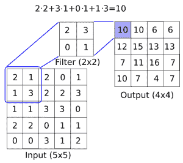
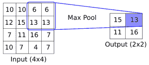
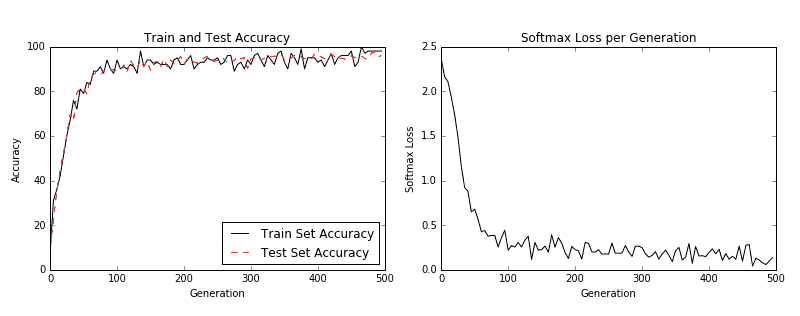
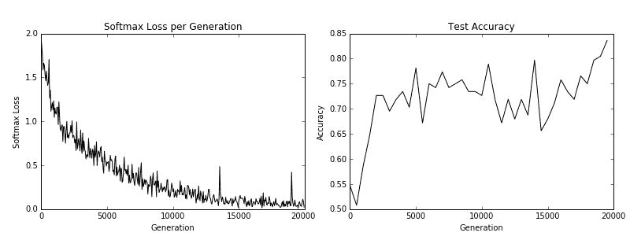
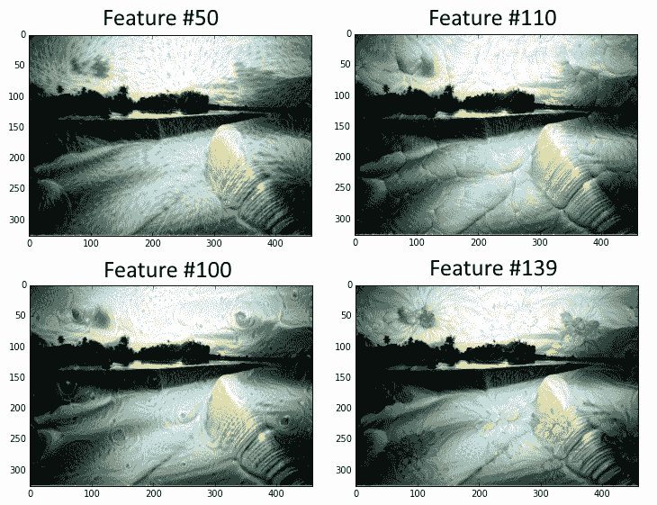

# 八、卷积神经网络

卷积神经网络（CNN）负责过去几年中图像识别的重大突破。在本章中，我们将介绍以下主题：

*   实现简单的 CNN
*   实现先进的 CNN
*   重新训练现有的 CNN 模型
*   应用 Stylenet 和神经式项目
*   实现 DeepDream

> 提醒一下，读者可以在[这里](https://github.com/nfmcclure/tensorflow_cookbook)，以及[ Packt 仓库](https://github.com/PacktPublishing/TensorFlow-Machine-Learning-Cookbook-Second-Edition)找到本章的所有代码。

# 介绍

在数学中，卷积是应用于另一个函数的输出的函数。在我们的例子中，我们将考虑在图像上应用矩阵乘法（滤波器）。出于我们的目的，我们将图像视为数字矩阵。这些数字可以表示像素或甚至图像属性。我们将应用于这些矩阵的卷积运算包括在图像上移动固定宽度的滤波器并应用逐元素乘法来得到我们的结果。

有关图像卷积如何工作的概念性理解，请参见下图：



图 1：如何在图像上应用卷积滤镜（长度与宽度之间的深度），以创建新的特征层。这里，我们有一个`2x2`卷积滤波器，在`5x5`输入的有效空间中操作，两个方向的步幅为 1。结果是`4x4`矩阵

CNN 还具有满足更多要求的其他操作，例如引入非线性（ReLU）或聚合参数（max P \ pool）以及其他类似操作。上图是在`5x5`数组上应用卷积运算的示例，其中卷积滤波器是`2x2`矩阵。步长为 1，我们只考虑有效的展示位置。此操作中的可训练变量将是`2x2`滤波器权重。在卷积之后，通常会跟进聚合操作，例如 max pool。如果我们在两个方向上采用步幅为 2 的`2x2`区域的最大值，下图提供了最大池如何操作的示例：



图 2：Max Pool 操作如何运行的示例。这里，我们有一个`2x2`窗口，在`4x4`输入的有效空间上操作，两个方向的步幅为 2。结果是`2x2`矩阵

虽然我们将首先创建自己的 CNN 进行图像识别，但强烈建议您使用现有的体系结构，我们将在本章的其余部分中进行操作。

> 通常采用预先训练好的网络并使用新数据集对其进行重新训练，并在最后使用新的完全连接层。这种方法非常有用，我们将在重新训练现有的 CNN 模型秘籍中进行说明，我们将重新训练现有的体系结构以改进我们的 CIFAR-10 预测。

# 实现简单的 CNN

在本文中，我们将开发一个四层卷积神经网络，以提高我们预测 MNIST 数字的准确率。前两个卷积层将各自由卷积-ReLU-Max 池操作组成，最后两个层将是完全连接的层。

## 准备

为了访问 MNIST 数据，TensorFlow 有一个`examples.tutorials`包，它具有很好的数据集加载函数。加载数据后，我们将设置模型变量，创建模型，批量训练模型，然后可视化损失，准确率和一些样本数字。

## 操作步骤

执行以下步骤：

1.  首先，我们将加载必要的库并启动图会话：

```py
import matplotlib.pyplot as plt
import numpy as np
import tensorflow as tf
from tensorflow.examples.tutorials.mnist import input_data
from tensorflow.python.framework import ops
ops.reset_default_graph()

sess = tf.Session()
```

1.  接下来，我们将加载数据并将图像转换为`28x28`数组：

```py
data_dir = 'temp' 
mnist = input_data.read_data_sets(data_dir, one_hot=False)
train_xdata = np.array([np.reshape(x, (28,28)) for x in mnist.train.images]) 
test_xdata = np.array([np.reshape(x, (28,28)) for x in mnist.test.images]) 
train_labels = mnist.train.labels 
test_labels = mnist.test.labels 
```

> 请注意，此处下载的 MNIST 数据集还包括验证集。此验证集通常与测试集的大小相同。如果我们进行任何超参数调整或模型选择，最好将其加载到其他测试中。

1.  现在我们将设置模型参数。请记住，图像的深度（通道数）为 1，因为这些图像是灰度的：

```py
batch_size = 100 
learning_rate = 0.005 
evaluation_size = 500 
image_width = train_xdata[0].shape[0] 
image_height = train_xdata[0].shape[1] 
target_size = max(train_labels) + 1 
num_channels = 1 
generations = 500 
eval_every = 5 
conv1_features = 25 
conv2_features = 50 
max_pool_size1 = 2 
max_pool_size2 = 2 
fully_connected_size1 = 100 
```

1.  我们现在可以声明数据的占位符。我们将声明我们的训练数据变量和测试数据变量。我们将针对训练和评估规模使用不同的批量大小。您可以根据可用于训练和评估的物理内存来更改这些内容：

```py
x_input_shape = (batch_size, image_width, image_height, num_channels) 
x_input = tf.placeholder(tf.float32, shape=x_input_shape) 
y_target = tf.placeholder(tf.int32, shape=(batch_size)) 
eval_input_shape = (evaluation_size, image_width, image_height, num_channels) 
eval_input = tf.placeholder(tf.float32, shape=eval_input_shape) 
eval_target = tf.placeholder(tf.int32, shape=(evaluation_size)) 
```

1.  我们将使用我们在前面步骤中设置的参数声明我们的卷积权重和偏差：

```py
conv1_weight = tf.Variable(tf.truncated_normal([4, 4, num_channels, conv1_features], stddev=0.1, dtype=tf.float32)) 
conv1_bias = tf.Variable(tf.zeros([conv1_features],dtype=tf.float32)) 
conv2_weight = tf.Variable(tf.truncated_normal([4, 4, conv1_features, conv2_features], stddev=0.1, dtype=tf.float32)) 
conv2_bias = tf.Variable(tf.zeros([conv2_features],dtype=tf.float32)) 
```

1.  接下来，我们将为模型的最后两层声明完全连接的权重和偏差：

```py
resulting_width = image_width // (max_pool_size1 * max_pool_size2) 
resulting_height = image_height // (max_pool_size1 * max_pool_size2) 
full1_input_size = resulting_width * resulting_height*conv2_features 
full1_weight = tf.Variable(tf.truncated_normal([full1_input_size, fully_connected_size1], stddev=0.1, dtype=tf.float32)) 
full1_bias = tf.Variable(tf.truncated_normal([fully_connected_size1], stddev=0.1, dtype=tf.float32)) 
full2_weight = tf.Variable(tf.truncated_normal([fully_connected_size1, target_size], stddev=0.1, dtype=tf.float32)) 
full2_bias = tf.Variable(tf.truncated_normal([target_size], stddev=0.1, dtype=tf.float32)) 
```

1.  现在我们将宣布我们的模型。我们首先创建一个模型函数。请注意，该函数将在全局范围内查找所需的层权重和偏差。此外，为了使完全连接的层工作，我们将第二个卷积层的输出展平，这样我们就可以在完全连接的层中使用它：

```py
def my_conv_net(input_data): 
   # First Conv-ReLU-MaxPool Layer 
    conv1 = tf.nn.conv2d(input_data, conv1_weight, strides=[1, 1, 1, 1], padding='SAME') 
    relu1 = tf.nn.relu(tf.nn.bias_add(conv1, conv1_bias)) 
    max_pool1 = tf.nn.max_pool(relu1, ksize=[1, max_pool_size1, max_pool_size1, 1], strides=[1, max_pool_size1, max_pool_size1, 1], padding='SAME') 
    # Second Conv-ReLU-MaxPool Layer 
    conv2 = tf.nn.conv2d(max_pool1, conv2_weight, strides=[1, 1, 1, 1], padding='SAME') 
    relu2 = tf.nn.relu(tf.nn.bias_add(conv2, conv2_bias)) 
    max_pool2 = tf.nn.max_pool(relu2, ksize=[1, max_pool_size2, max_pool_size2, 1], strides=[1, max_pool_size2, max_pool_size2, 1], padding='SAME') 
    # Transform Output into a 1xN layer for next fully connected layer 
    final_conv_shape = max_pool2.get_shape().as_list() 
    final_shape = final_conv_shape[1] * final_conv_shape[2] * final_conv_shape[3] 
    flat_output = tf.reshape(max_pool2, [final_conv_shape[0], final_shape]) 
    # First Fully Connected Layer 
    fully_connected1 = tf.nn.relu(tf.add(tf.matmul(flat_output, full1_weight), full1_bias)) 
    # Second Fully Connected Layer 
    final_model_output = tf.add(tf.matmul(fully_connected1, full2_weight), full2_bias) 
    return final_model_output 
```

1.  接下来，我们可以在训练和测试数据上声明模型：

```py
model_output = my_conv_net(x_input) 
test_model_output = my_conv_net(eval_input) 
```

1.  我们将使用的损失函数是 softmax 函数。我们使用稀疏 softmax，因为我们的预测只是一个类别，而不是多个类别。我们还将使用一个对 logits 而不是缩放概率进行操作的损失函数：

```py
loss = tf.reduce_mean(tf.nn.sparse_softmax_cross_entropy_with_logits(logits=model_output, labels=y_target)) 
```

1.  接下来，我们将创建一个训练和测试预测函数。然后我们还将创建一个准确率函数来确定模型在每个批次上的准确率：

```py
prediction = tf.nn.softmax(model_output) 
test_prediction = tf.nn.softmax(test_model_output) 
# Create accuracy function 
def get_accuracy(logits, targets): 
    batch_predictions = np.argmax(logits, axis=1) 
    num_correct = np.sum(np.equal(batch_predictions, targets)) 
    return 100\. * num_correct/batch_predictions.shape[0] 
```

1.  现在我们将创建我们的优化函数，声明训练步骤，并初始化所有模型变量：

```py
my_optimizer = tf.train.MomentumOptimizer(learning_rate, 0.9) 
train_step = my_optimizer.minimize(loss) 
# Initialize Variables 
init = tf.global_variables_initializer() 
sess.run(init)
```

1.  我们现在可以开始训练我们的模型。我们以随机选择的批次循环数据。我们经常选择在训练上评估模型并测试批次并记录准确率和损失。我们可以看到，经过 500 代，我们可以在测试数据上快速达到 96％-97％的准确率：

```py
train_loss = [] 
train_acc = [] 
test_acc = [] 
for i in range(generations): 
    rand_index = np.random.choice(len(train_xdata), size=batch_size) 
    rand_x = train_xdata[rand_index] 
    rand_x = np.expand_dims(rand_x, 3) 
    rand_y = train_labels[rand_index] 
    train_dict = {x_input: rand_x, y_target: rand_y} 
    sess.run(train_step, feed_dict=train_dict) 
    temp_train_loss, temp_train_preds = sess.run([loss, prediction], feed_dict=train_dict) 
    temp_train_acc = get_accuracy(temp_train_preds, rand_y) 
    if (i+1) % eval_every == 0: 
        eval_index = np.random.choice(len(test_xdata), size=evaluation_size) 
        eval_x = test_xdata[eval_index] 
        eval_x = np.expand_dims(eval_x, 3) 
        eval_y = test_labels[eval_index] 
        test_dict = {eval_input: eval_x, eval_target: eval_y} 
        test_preds = sess.run(test_prediction, feed_dict=test_dict) 
        temp_test_acc = get_accuracy(test_preds, eval_y) 
        # Record and print results 
        train_loss.append(temp_train_loss) 
        train_acc.append(temp_train_acc) 
        test_acc.append(temp_test_acc) 
        acc_and_loss = [(i+1), temp_train_loss, temp_train_acc, temp_test_acc] 
        acc_and_loss = [np.round(x,2) for x in acc_and_loss] 
        print('Generation # {}. Train Loss: {:.2f}. Train Acc (Test Acc): {:.2f} ({:.2f})'.format(*acc_and_loss)) 
```

1.  这导致以下输出：

```py
Generation # 5\. Train Loss: 2.37\. Train Acc (Test Acc): 7.00 (9.80) 
Generation # 10\. Train Loss: 2.16\. Train Acc (Test Acc): 31.00 (22.00) 
Generation # 15\. Train Loss: 2.11\. Train Acc (Test Acc): 36.00 (35.20) 
...
Generation # 490\. Train Loss: 0.06\. Train Acc (Test Acc): 98.00 (97.40) 
Generation # 495\. Train Loss: 0.10\. Train Acc (Test Acc): 98.00 (95.40) 
Generation # 500\. Train Loss: 0.14\. Train Acc (Test Acc): 98.00 (96.00) 
```

1.  以下是使用`Matplotlib`绘制损耗和精度的代码：

```py
eval_indices = range(0, generations, eval_every) 
# Plot loss over time 
plt.plot(eval_indices, train_loss, 'k-') 
plt.title('Softmax Loss per Generation') 
plt.xlabel('Generation') 
plt.ylabel('Softmax Loss') 
plt.show() 

# Plot train and test accuracy 
plt.plot(eval_indices, train_acc, 'k-', label='Train Set Accuracy') 
plt.plot(eval_indices, test_acc, 'r--', label='Test Set Accuracy') 
plt.title('Train and Test Accuracy') 
plt.xlabel('Generation') 
plt.ylabel('Accuracy') 
plt.legend(loc='lower right') 
plt.show() 
```

然后我们得到以下图：



图 3：左图是我们 500 代训练中的训练和测试集精度。右图是超过 500 代的 softmax 损失值。

1.  如果我们想要绘制最新批次结果的样本，下面是绘制由六个最新结果组成的样本的代码：

```py
# Plot the 6 of the last batch results: 
actuals = rand_y[0:6] 
predictions = np.argmax(temp_train_preds,axis=1)[0:6] 
images = np.squeeze(rand_x[0:6]) 
Nrows = 2 
Ncols = 3 
for i in range(6): 
    plt.subplot(Nrows, Ncols, i+1) 
    plt.imshow(np.reshape(images[i], [28,28]), cmap='Greys_r') 
    plt.title('Actual: ' + str(actuals[i]) + ' Pred: ' + str(predictions[i]), fontsize=10) 
    frame = plt.gca() 
    frame.axes.get_xaxis().set_visible(False) 
    frame.axes.get_yaxis().set_visible(False) 
```

我们得到前面代码的以下输出：


图 4：六个随机图像的绘图，标题中包含实际值和预测值。右下图预计是 3，而事实上它是 1

## 工作原理

我们提高了 MNIST 数据集的表现，并构建了一个模型，在从头开始训练时，可快速达到约 97％的准确率。我们的前两层是卷积，ReLU 和 Max Pooling 的组合。第二层是完全连接的层。我们以 100 个批次进行了训练，并研究了我们训练的几代的准确率和损失。最后，我们还绘制了六个随机数字和每个数字的预测/实际值。

CNN 非常适合图像识别。造成这种情况的部分原因是卷积层创建了自己的低级特征，当它们遇到重要的部分图像时会被激活。这种类型的模型自己创建特征并将其用于预测。

## 更多

在过去几年中，CNN 模型在图像识别方面取得了巨大进步。正在探索许多新颖的想法，并且经常发现新的架构。该领域的一个很好的论文库是一个名为 [Arxiv.org](https://arxiv.org/) 的仓库网站，由康奈尔大学创建和维护。 Arxiv.org 包括许多领域的一些最新论文，包括计算机科学和计算机科学子领域，如[计算机视觉和图像识别](https://arxiv.org/list/cs.CV/recent)。

## 另见

以下列出了一些可用于了解 CNN 的优秀资源：

*   [斯坦福大学有一个很棒的维基](http://scarlet.stanford.edu/teach/index.php/An_Introduction_to_Convolutional_Neural_Networks)
*   [迈克尔·尼尔森的深度学习](http://neuralnetworksanddeeplearning.com/chap6.html)
*   [吴建新介绍卷积神经网络](https://pdfs.semanticscholar.org/450c/a19932fcef1ca6d0442cbf52fec38fb9d1e5.pdf)

# 实现先进的 CNN

能够扩展 CNN 模型以进行图像识别非常重要，这样我们才能理解如何增加网络的深度。如果我们有足够的数据，这可能会提高我们预测的准确率。扩展 CNN 网络的深度是以标准方式完成的：我们只是重复卷积，最大池和 ReLU，直到我们对深度感到满意为止。许多更精确的图像识别网络以这种方式操作。

## 准备

在本文中，我们将实现一种更先进的读取图像数据的方法，并使用更大的 CNN 在 [CIFAR10](https://www.cs.toronto.edu/~kriz/cifar.html) 数据集上进行图像识别。该数据集具有 60,000 个`32x32`图像，这些图像恰好属于十个可能类别中的一个。图像的潜在类别是飞机，汽车，鸟，猫，鹿，狗，青蛙，马，船和卡车。另请参阅“另请参阅”部分中的第一个要点。

大多数图像数据集太大而无法放入内存中。我们可以使用 TensorFlow 设置一个图像管道，一次从一个文件中一次读取。我们通过设置图像阅读器，然后创建在图像阅读器上运行的批量队列来完成此操作。

此外，对于图像识别数据，通常在将图像发送之前随机扰动图像以进行训练。在这里，我们将随机裁剪，翻转和更改亮度。

此秘籍是官方 TensorFlow CIFAR-10 教程的改编版本，可在本章末尾的“另请参阅”部分中找到。我们将教程浓缩为一个脚本，我们将逐行完成并解释所有必要的代码。我们还将一些常量和参数恢复为原始引用的纸张值;我们将在适当的步骤中标记这一点。

## 操作步骤

执行以下步骤：

1.  首先，我们加载必要的库并启动图会话：

```py
import os 
import sys 
import tarfile 
import matplotlib.pyplot as plt 
import numpy as np 
import tensorflow as tf 
from six.moves import urllib 
sess = tf.Session()
```

1.  现在我们将声明一些模型参数。我们的批量大小为 128（用于训练和测试）。我们将每 50 代输出一次状态，总共运行 20,000 代。每 500 代，我们将评估一批测试数据。然后我们将声明一些图像参数，高度和宽度，以及随机裁剪图像的大小。有三个通道（红色，绿色和蓝色），我们有十个不同的目标。然后我们将声明我们将从队列中存储数据和图像批次的位置：

```py
batch_size = 128 
output_every = 50 
generations = 20000 
eval_every = 500 
image_height = 32 
image_width = 32 
crop_height = 24 
crop_width = 24 
num_channels = 3 
num_targets = 10 
data_dir = 'temp' 
extract_folder = 'cifar-10-batches-bin' 
```

1.  建议您在我们向好的模型迈进时降低学习率，因此我们将以指数方式降低学习率：初始学习率将设置为 0.1，并且我们将以 250％的指数方式将其降低 10％代。确切的公式将由`0.1 · 0.9^(x / 250)`给出，其中`x`是当前世代号。默认情况下，此值会持续降低，但 TensorFlow 会接受仅更新学习率的阶梯参数。这里我们设置一些参数供将来使用：

```py
learning_rate = 0.1 
lr_decay = 0.9 
num_gens_to_wait = 250\. 
```

1.  现在我们将设置参数，以便我们可以读取二进制 CIFAR-10 图像：

```py
image_vec_length = image_height * image_width * num_channels 
record_length = 1 + image_vec_length 
```

1.  接下来，我们将设置数据目录和 URL 以下载 CIFAR-10 图像，如果我们还没有它们：

```py
data_dir = 'temp' 
if not os.path.exists(data_dir): 
    os.makedirs(data_dir) 
cifar10_url = 'http://www.cs.toronto.edu/~kriz/cifar-10-binary.tar.gz' 
data_file = os.path.join(data_dir, 'cifar-10-binary.tar.gz') 
if not os.path.isfile(data_file): 
    # Download file 
    filepath, _ = urllib.request.urlretrieve(cifar10_url, data_file) 
    # Extract file 
    tarfile.open(filepath, 'r:gz').extractall(data_dir) 
```

1.  我们将设置记录阅读器并使用以下`read_cifar_files()`函数返回随机失真的图像。首先，我们需要声明一个读取固定字节长度的记录读取器对象。在我们读取图像队列之后，我们将图像和标签分开。最后，我们将使用 TensorFlow 的内置图像修改函数随机扭曲图像：

```py
def read_cifar_files(filename_queue, distort_images = True): 
    reader = tf.FixedLengthRecordReader(record_bytes=record_length) 
    key, record_string = reader.read(filename_queue) 
    record_bytes = tf.decode_raw(record_string, tf.uint8) 
    # Extract label 
    image_label = tf.cast(tf.slice(record_bytes, [0], [1]), tf.int32) 
    # Extract image 
    image_extracted = tf.reshape(tf.slice(record_bytes, [1], [image_vec_length]), [num_channels, image_height, image_width]) 
    # Reshape image 
    image_uint8image = tf.transpose(image_extracted, [1, 2, 0]) 
    reshaped_image = tf.cast(image_uint8image, tf.float32) 
    # Randomly Crop image 
    final_image = tf.image.resize_image_with_crop_or_pad(reshaped_image, crop_width, crop_height) 
    if distort_images: 
        # Randomly flip the image horizontally, change the brightness and contrast 
        final_image = tf.image.random_flip_left_right(final_image) 
        final_image = tf.image.random_brightness(final_image,max_delta=63) 
        final_image = tf.image.random_contrast(final_image,lower=0.2, upper=1.8) 
    # Normalize whitening 
    final_image = tf.image.per_image_standardization(final_image) 
    return final_image, image_label
```

1.  现在我们将声明一个函数，它将填充我们的图像管道以供批量器使用。我们首先需要设置一个我们想要读取的图像文件列表，并定义如何使用通过预构建的 TensorFlow 函数创建的输入生成器对象来读取它们。输入生成器可以传递给我们在上一步中创建的读取函数：`read_cifar_files()`。然后我们将在队列中设置批量阅读器：`shuffle_batch()`：

```py
def input_pipeline(batch_size, train_logical=True): 
    if train_logical: 
        files = [os.path.join(data_dir, extract_folder, 'data_batch_{}.bin'.format(i)) for i in range(1,6)] 
    else: 
        files = [os.path.join(data_dir, extract_folder, 'test_batch.bin')] 
    filename_queue = tf.train.string_input_producer(files) 
    image, label = read_cifar_files(filename_queue) 

    min_after_dequeue = 1000 
    capacity = min_after_dequeue + 3 * batch_size 
    example_batch, label_batch = tf.train.shuffle_batch([image, label], batch_size, capacity, min_after_dequeue) 
    return example_batch, label_batch
```

> 正确设置`min_after_dequeue`很重要。此参数负责设置用于采样的图像缓冲区的最小大小。官方 TensorFlow 文档建议将其设置为`(#threads + error margin)*batch_size`。请注意，将其设置为更大的大小会导致更均匀的混洗，因为它正在从队列中的更大数据集进行混洗，但是在此过程中也将使用更多内存。

1.  接下来，我们可以声明我们的模型函数。我们将使用的模型有两个卷积层，后面是三个完全连接的层。为了使变量声明更容易，我们首先声明两个变量函数。两个卷积层将分别创建 64 个特征。第一个完全连接的层将第二个卷积层与 384 个隐藏节点连接起来。第二个完全连接的操作将这 384 个隐藏节点连接到 192 个隐藏节点。最后的隐藏层操作将 192 个节点连接到我们试图预测的 10 个输出类。请参阅以下`#`前面的内联注释：

```py
def cifar_cnn_model(input_images, batch_size, train_logical=True): 
    def truncated_normal_var(name, shape, dtype): 
        return tf.get_variable(name=name, shape=shape, dtype=dtype, initializer=tf.truncated_normal_initializer(stddev=0.05)) 
    def zero_var(name, shape, dtype): 
        return tf.get_variable(name=name, shape=shape, dtype=dtype, initializer=tf.constant_initializer(0.0))
    # First Convolutional Layer 
    with tf.variable_scope('conv1') as scope: 
        # Conv_kernel is 5x5 for all 3 colors and we will create 64 features 
        conv1_kernel = truncated_normal_var(name='conv_kernel1', shape=[5, 5, 3, 64], dtype=tf.float32) 
        # We convolve across the image with a stride size of 1 
        conv1 = tf.nn.conv2d(input_images, conv1_kernel, [1, 1, 1, 1], padding='SAME') 
        # Initialize and add the bias term 
        conv1_bias = zero_var(name='conv_bias1', shape=[64], dtype=tf.float32) 
        conv1_add_bias = tf.nn.bias_add(conv1, conv1_bias) 
        # ReLU element wise 
        relu_conv1 = tf.nn.relu(conv1_add_bias) 
    # Max Pooling 
    pool1 = tf.nn.max_pool(relu_conv1, ksize=[1, 3, 3, 1], strides=[1, 2, 2, 1],padding='SAME', name='pool_layer1') 

    # Local Response Normalization 
    norm1 = tf.nn.lrn(pool1, depth_radius=5, bias=2.0, alpha=1e-3, beta=0.75, name='norm1') 
    # Second Convolutional Layer 
    with tf.variable_scope('conv2') as scope: 
        # Conv kernel is 5x5, across all prior 64 features and we create 64 more features 
        conv2_kernel = truncated_normal_var(name='conv_kernel2', shape=[5, 5, 64, 64], dtype=tf.float32) 
        # Convolve filter across prior output with stride size of 1 
        conv2 = tf.nn.conv2d(norm1, conv2_kernel, [1, 1, 1, 1], padding='SAME') 
        # Initialize and add the bias 
        conv2_bias = zero_var(name='conv_bias2', shape=[64], dtype=tf.float32) 
        conv2_add_bias = tf.nn.bias_add(conv2, conv2_bias) 
        # ReLU element wise 
        relu_conv2 = tf.nn.relu(conv2_add_bias) 
    # Max Pooling 
    pool2 = tf.nn.max_pool(relu_conv2, ksize=[1, 3, 3, 1], strides=[1, 2, 2, 1], padding='SAME', name='pool_layer2')     
     # Local Response Normalization (parameters from paper) 
    norm2 = tf.nn.lrn(pool2, depth_radius=5, bias=2.0, alpha=1e-3, beta=0.75, name='norm2') 
    # Reshape output into a single matrix for multiplication for the fully connected layers 
    reshaped_output = tf.reshape(norm2, [batch_size, -1]) 
    reshaped_dim = reshaped_output.get_shape()[1].value 

    # First Fully Connected Layer 
    with tf.variable_scope('full1') as scope: 
        # Fully connected layer will have 384 outputs. 
        full_weight1 = truncated_normal_var(name='full_mult1', shape=[reshaped_dim, 384], dtype=tf.float32) 
        full_bias1 = zero_var(name='full_bias1', shape=[384], dtype=tf.float32) 
        full_layer1 = tf.nn.relu(tf.add(tf.matmul(reshaped_output, full_weight1), full_bias1)) 
    # Second Fully Connected Layer 
    with tf.variable_scope('full2') as scope: 
        # Second fully connected layer has 192 outputs. 
        full_weight2 = truncated_normal_var(name='full_mult2', shape=[384, 192], dtype=tf.float32) 
        full_bias2 = zero_var(name='full_bias2', shape=[192], dtype=tf.float32) 
        full_layer2 = tf.nn.relu(tf.add(tf.matmul(full_layer1, full_weight2), full_bias2)) 
    # Final Fully Connected Layer -> 10 categories for output (num_targets) 
    with tf.variable_scope('full3') as scope: 
        # Final fully connected layer has 10 (num_targets) outputs. 
        full_weight3 = truncated_normal_var(name='full_mult3', shape=[192, num_targets], dtype=tf.float32) 
        full_bias3 =  zero_var(name='full_bias3', shape=[num_targets], dtype=tf.float32) 
        final_output = tf.add(tf.matmul(full_layer2, full_weight3), full_bias3) 

    return final_output
```

> 我们的本地响应标准化参数取自本文，并在本文的“另请参见”部分中引用。

1.  现在我们将创建损失函数。我们将使用 softmax 函数，因为图片只能占用一个类别，因此输出应该是十个目标的概率分布：

```py
def cifar_loss(logits, targets): 
    # Get rid of extra dimensions and cast targets into integers 
    targets = tf.squeeze(tf.cast(targets, tf.int32)) 
    # Calculate cross entropy from logits and targets 
    cross_entropy = tf.nn.sparse_softmax_cross_entropy_with_logits(logits=logits, labels=targets) 
    # Take the average loss across batch size 
    cross_entropy_mean = tf.reduce_mean(cross_entropy) 
    return cross_entropy_mean 
```

1.  接下来，我们宣布我们的训练步骤。学习率将以指数阶跃函数降低：

```py
def train_step(loss_value, generation_num): 
    # Our learning rate is an exponential decay (stepped down) 
    model_learning_rate = tf.train.exponential_decay(learning_rate, generation_num, num_gens_to_wait, lr_decay, staircase=True) 
    # Create optimizer 
    my_optimizer = tf.train.GradientDescentOptimizer(model_learning_rate) 
    # Initialize train step 
    train_step = my_optimizer.minimize(loss_value) 
    return train_step 
```

1.  我们还必须具有精确度函数，以计算一批图像的准确率。我们将输入 logits 和目标向量，并输出平均精度。然后我们可以将它用于训练和测试批次：

```py
def accuracy_of_batch(logits, targets): 
    # Make sure targets are integers and drop extra dimensions 
    targets = tf.squeeze(tf.cast(targets, tf.int32)) 
    # Get predicted values by finding which logit is the greatest 
    batch_predictions = tf.cast(tf.argmax(logits, 1), tf.int32) 
    # Check if they are equal across the batch 
    predicted_correctly = tf.equal(batch_predictions, targets) 
    # Average the 1's and 0's (True's and False's) across the batch size 
    accuracy = tf.reduce_mean(tf.cast(predicted_correctly, tf.float32)) 
    return accuracy 
```

1.  现在我们有了一个图像管道函数，我们可以初始化训练图像管道和测试图像管道：

```py
images, targets = input_pipeline(batch_size, train_logical=True) 
test_images, test_targets = input_pipeline(batch_size, train_logical=False)
```

1.  接下来，我们将初始化训练输出和测试输出的模型。值得注意的是，我们必须在创建训练模型后声明`scope.reuse_variables()`，这样，当我们为测试网络声明模型时，它将使用相同的模型参数：

```py
with tf.variable_scope('model_definition') as scope: 
    # Declare the training network model 
    model_output = cifar_cnn_model(images, batch_size) 
    # Use same variables within scope 
    scope.reuse_variables() 
    # Declare test model output 
    test_output = cifar_cnn_model(test_images, batch_size) 
```

1.  我们现在可以初始化我们的损耗和测试精度函数。然后我们将声明`generation`变量。此变量需要声明为不可训练，并传递给我们的训练函数，该函数在学习率指数衰减计算中使用它：

```py
loss = cifar_loss(model_output, targets) 
accuracy = accuracy_of_batch(test_output, test_targets) 
generation_num = tf.Variable(0, trainable=False) 
train_op = train_step(loss, generation_num) 
```

1.  我们现在将初始化所有模型的变量，然后通过运行 TensorFlow 函数`start_queue_runners()`来启动图像管道。当我们开始训练或测试模型输出时，管道将输入一批图像来代替饲料字典：

```py
init = tf.global_variables_initializer() 
sess.run(init) 
tf.train.start_queue_runners(sess=sess) 
```

1.  我们现在循环训练我们的训练，节省训练损失和测试准确率：

```py
train_loss = [] 
test_accuracy = [] 
for i in range(generations): 
    _, loss_value = sess.run([train_op, loss]) 
    if (i+1) % output_every == 0: 
        train_loss.append(loss_value) 
        output = 'Generation {}: Loss = {:.5f}'.format((i+1), loss_value) 
        print(output) 
    if (i+1) % eval_every == 0: 
        [temp_accuracy] = sess.run([accuracy]) 
        test_accuracy.append(temp_accuracy) 
        acc_output = ' --- Test Accuracy= {:.2f}%.'.format(100\. * temp_accuracy) 
        print(acc_output) 
```

1.  这导致以下输出：

```py
...
Generation 19500: Loss = 0.04461 
 --- Test Accuracy = 80.47%. 
Generation 19550: Loss = 0.01171 
Generation 19600: Loss = 0.06911 
Generation 19650: Loss = 0.08629 
Generation 19700: Loss = 0.05296 
Generation 19750: Loss = 0.03462 
Generation 19800: Loss = 0.03182 
Generation 19850: Loss = 0.07092 
Generation 19900: Loss = 0.11342 
Generation 19950: Loss = 0.08751 
Generation 20000: Loss = 0.02228 
 --- Test Accuracy = 83.59%. 
```

1.  最后，这里有一些`matplotlib`代码将绘制在训练过程中的损失和测试准确率：

```py
eval_indices = range(0, generations, eval_every) 
output_indices = range(0, generations, output_every) 
# Plot loss over time 
plt.plot(output_indices, train_loss, 'k-') 
plt.title('Softmax Loss per Generation') 
plt.xlabel('Generation') 
plt.ylabel('Softmax Loss') 
plt.show() 

# Plot accuracy over time 
plt.plot(eval_indices, test_accuracy, 'k-') 
plt.title('Test Accuracy') 
plt.xlabel('Generation') 
plt.ylabel('Accuracy') 
plt.show() 
```

我们得到以下秘籍的以下绘图：



图 5：训练损失在左侧，测试精度在右侧。对于 CIFAR-10 图像识别 CNN，我们能够实现在测试集上达到约 75％准确率的模型

## 工作原理

在我们下载了 CIFAR-10 数据之后，我们建立了一个图像管道而不是使用源字典。有关图像管道的更多信息，请参阅官方 TensorFlow CIFAR-10 教程。我们使用此训练和测试管道来尝试预测图像的正确类别。最后，该模型在测试集上达到了约 75％的准确率。

## 另见

*   有关 CIFAR-10 数据集的更多信息，[请参阅学习 Tiny Images 的多个特征层，Alex Krizhevsky，2009](https://www.cs.toronto.edu/~kriz/learning-features-2009-TR.pdf)
*   要查看原始的 TensorFlow 代码，请参阅[此链接](https://github.com/tensorflow/models/tree/master/tutorials/image/cifar10)
*   有关局部响应归一化的更多信息，请参阅[使用深度卷积神经网络的 ImageNet 分类，Krizhevsky，A. 等人，2012](http://papers.nips.cc/paper/4824-imagenet-classification-with-deep-convolutional-neural-networks)

# 重新训练现有的 CNN 模型

从头开始训练新的图像识别需要大量的时间和计算能力。如果我们可以采用先前训练的网络并使用我们的图像重新训练它，它可以节省我们的计算时间。对于此秘籍，我们将展示如何使用预先训练的 TensorFlow 图像识别模型并对其进行微调以处理不同的图像集。

## 准备

其思想是从卷积层重用先前模型的权重和结构，并重新训练网络顶部的完全连接层。

TensorFlow 在现有 CNN 模型的基础上创建了一个关于训练的教程（请参阅下一节中的第一个要点）。在本文中，我们将说明如何对 CIFAR-10 使用相同的方法。我们将采用的 CNN 网络使用一种非常流行的架构，称为 Inception。 Inception CNN 模型由 Google 创建，在许多图像识别基准测试中表现非常出色。有关详细信息，请参阅“另请参阅”部分的第二个要点中的纸张参考。

我们将介绍的主要 Python 脚本显示如何下载 CIFAR-10 图像数据并自动分离，标记和保存图像到每个训练和测试文件夹中的十个类。之后，我们将重申如何在我们的图像上训练网络。

## 操作步骤

执行以下步骤：

1.  我们首先加载必要的库来下载，解压缩和保存 CIFAR-10 图像：

```py
import os 
import tarfile 
import _pickle as cPickle 
import numpy as np 
import urllib.request 
import scipy.misc
from imageio import imwrite
```

1.  我们现在声明 CIFAR-10 数据链接并创建我们将存储数据的临时目录。我们还将在以后保存图像时声明要引用的十个类别：

```py
cifar_link = 'https://www.cs.toronto.edu/~kriz/cifar-10-python.tar.gz' 
data_dir = 'temp' 
if not os.path.isdir(data_dir): 
    os.makedirs(data_dir) 
objects = ['airplane', 'automobile', 'bird', 'cat', 'deer', 'dog', 'frog', 'horse', 'ship', 'truck'] 
```

1.  现在我们将下载 CIFAR-10 `.tar`数据文件，并解压该文件：

```py
target_file = os.path.join(data_dir, 'cifar-10-python.tar.gz') 
if not os.path.isfile(target_file): 
    print('CIFAR-10 file not found. Downloading CIFAR data (Size = 163MB)') 
    print('This may take a few minutes, please wait.') 
    filename, headers = urllib.request.urlretrieve(cifar_link, target_file) 
# Extract into memory 
tar = tarfile.open(target_file) 
tar.extractall(path=data_dir) 
tar.close() 
```

1.  我们现在为训练创建必要的文件夹结构。临时目录将有两个文件夹，`train_dir`和`validation_dir`。在每个文件夹中，我们将为每个类别创建 10 个子文件夹：

```py
# Create train image folders 
train_folder = 'train_dir' 
if not os.path.isdir(os.path.join(data_dir, train_folder)): 
    for i in range(10): 
        folder = os.path.join(data_dir, train_folder, objects[i]) 
        os.makedirs(folder) 
# Create test image folders 
test_folder = 'validation_dir' 
if not os.path.isdir(os.path.join(data_dir, test_folder)): 
    for i in range(10): 
        folder = os.path.join(data_dir, test_folder, objects[i]) 
        os.makedirs(folder)
```

1.  为了保存图像，我们将创建一个从内存加载它们并将它们存储在图像字典中的函数：

```py
def load_batch_from_file(file): 
    file_conn = open(file, 'rb') 
    image_dictionary = cPickle.load(file_conn, encoding='latin1') 
    file_conn.close() 
    return(image_dictionary) 
```

1.  使用前面的字典，我们将使用以下函数将每个文件保存在正确的位置：

```py
def save_images_from_dict(image_dict, folder='data_dir'): 

    for ix, label in enumerate(image_dict['labels']): 
        folder_path = os.path.join(data_dir, folder, objects[label]) 
        filename = image_dict['filenames'][ix] 
        #Transform image data 
        image_array = image_dict['data'][ix] 
        image_array.resize([3, 32, 32]) 
        # Save image 
        output_location = os.path.join(folder_path, filename) 
        imwrite(output_location,image_array.transpose()) 
```

1.  使用上述函数，我们可以遍历下载的数据文件并将每个图像保存到正确的位置：

```py
data_location = os.path.join(data_dir, 'cifar-10-batches-py') 
train_names = ['data_batch_' + str(x) for x in range(1,6)] 
test_names = ['test_batch'] 
# Sort train images 
for file in train_names: 
    print('Saving images from file: {}'.format(file)) 
    file_location = os.path.join(data_dir, 'cifar-10-batches-py', file) 
    image_dict = load_batch_from_file(file_location) 
    save_images_from_dict(image_dict, folder=train_folder) 
# Sort test images 
for file in test_names: 
    print('Saving images from file: {}'.format(file)) 
    file_location = os.path.join(data_dir, 'cifar-10-batches-py', file) 
    image_dict = load_batch_from_file(file_location) 
    save_images_from_dict(image_dict, folder=test_folder)
```

1.  我们脚本的最后一部分创建了图像标签文件，这是我们需要的最后一条信息。这个文件让我们将输出解释为标签而不是数字索引：

```py
cifar_labels_file = os.path.join(data_dir,'cifar10_labels.txt') 
print('Writing labels file, {}'.format(cifar_labels_file)) 
with open(cifar_labels_file, 'w') as labels_file: 
    for item in objects: 
        labels_file.write("{}n".format(item)) 
```

1.  当前面的脚本运行时，它将下载图像并将它们分类到 TensorFlow 再训练教程所期望的正确文件夹结构中。完成后，我们只需按照教程进行操作即可。首先，我们应该克隆教程仓库：

```py
git clone https://github.com/tensorflow/models/tree/master/research/inception 
```

1.  为了使用先前训练的模型，我们必须下载网络权重并将其应用于我们的模型。为此，[您必须访问该站点](https://github.com/tensorflow/models/tree/master/research/slim)，并按照说明下载并安装 cifar10 模型架构和权重。您还将最终下载包含下面描述的构建，训练和测试脚本的数据目录。

> 对于此步骤，我们导航到 research / inception / inception 目录，然后执行以下命令，`--train_directory`，`--validation_directory`，`--output_directory`和`--labels_file`的路径指向相对路径或完整路径创建的目录结构。

1.  现在我们将图像放在正确的文件夹结构中，我们必须将它们变成`TFRecords`对象。我们通过运行以下命令来完成此操作：

```py
    me@computer:~$ python3 data/build_image_data.py
    --train_directory="temp/train_dir/"
    --validation_directory="temp/validation_dir"
    --output_directory="temp/" --labels_file="temp/cifar10_labels.txt"

```

1.  现在我们将使用`bazel`训练模型，将参数设置为`true`。该脚本每 10 代输出一次损失。我们可以随时终止此过程，模型输出将在`temp/training_results`文件夹中。我们可以从此文件夹加载模型以进行评估：

```py
    me@computer:~$ bazel-bin/inception/flowers_train
    --train_dir="temp/training_results" --data_dir="temp/data_dir"
    --pretrained_model_checkpoint_path="model.ckpt-157585"
    --fine_tune=True --initial_learning_rate=0.001
    --input_queue_memory_factor=1
```

1.  这应该导致输出类似于以下内容：

```py
2018-06-02 11:10:10.557012: step 1290, loss = 2.02 (1.2  examples/sec; 23.771 sec/batch)
...

```

## 工作原理

关于预训练 CNN 上的训练的官方 TensorFlow 教程需要设置一个文件夹;我们从 CIFAR-10 数据创建的设置。然后我们将数据转换为所需的`TFRecords`格式并开始训练模型。请记住，我们正在微调模型并重新训练顶部的完全连接的层以适合我们的 10 类数据。

## 另见

*   [官方 Tensorflow Inception-v3 教程](https://www.tensorflow.org/tutoriaimg/image_recognition)
*   [Googlenet Inception-v3 文件](https://arxiv.org/abs/1512.00567)

# 应用 StyleNet 和 NeuralStyle 项目

一旦我们对 CNN 进行了图像识别训练，我们就可以将网络本身用于一些有趣的数据和图像处理。 Stylenet 是一种尝试从一张图片中学习图像样式并将其应用于第二张图片同时保持第二图像结构（或内容）完整的过程。如果我们能够找到与样式强烈相关的中间 CNN 节点，这可能是可能的，与图像的内容分开。

## 准备

Stylenet 是一个过程，它接收两个图像并将一个图像的样式应用于第二个图像的内容。它基于 2015 年的着名论文“艺术风格的神经算法”（参见下一节的第一个要点）。作者在一些 CNN 中找到了一个属性，其中存在中间层，它们似乎编码图片的样式，有些编码图片的内容。为此，如果我们训练样式图片上的样式层和原始图像上的内容层，并反向传播那些计算的损失，我们可以将原始图像更改为更像样式图像。

为了实现这一目标，我们将下载本文推荐的网络;叫做 imagenet-vgg-19。还有一个 imagenet-vgg-16 网络也可以使用，但是本文推荐使用 imagenet-vgg-19。

## 操作步骤

执行以下步骤：

1.  首先，我们将以`mat`格式下载预先训练好的网络。 `mat`格式是`matlab`对象，Python 中的`scipy`包有一个可以读取它的方法。下载`mat`对象的链接在这里。我们将此模型保存在 Python 脚本所在的同一文件夹中，以供参考：

```py
http://www.vlfeat.org/matconvnet/models/beta16/imagenet-vgg-verydeep-19.mat 
```

1.  我们将通过加载必要的库来启动我们的 Python 脚本：

```py
import os
import scipy.io
import scipy.misc
import imageio
from skimage.transform import resize
from operator import mul
from functools import reduce
import numpy as np
import tensorflow as tf
from tensorflow.python.framework import ops
ops.reset_default_graph()
```

1.  然后我们可以声明两个图像的位置：原始图像和样式图像。出于我们的目的，我们将使用本书的封面图片作为原始图像;对于风格形象，我们将使用 Vincent van Gough 的星夜。随意使用您想要的任何两张图片。如果您选择使用这些图片，[可以在本书的 GitHub 网站上找到（导航到 Styelnet 部分）](https://github.com/nfmcclure/tensorflow_cookbook)：

```py
original_image_file = 'temp/book_cover.jpg' 
style_image_file = 'temp/starry_night.jpg' 
```

1.  我们将为我们的模型设置一些参数：`mat`文件的位置，权重，学习率，代数以及输出中间图像的频率。对于权重，有助于在原始图像上高度加权样式图像。应根据所需结果的变化调整这些超参数：

```py
vgg_path = 'imagenet-vgg-verydeep-19.mat'
original_image_weight = 5.0
style_image_weight = 500.0
regularization_weight = 100
learning_rate = 10
generations = 100
output_generations = 25
beta1 = 0.9
beta2 = 0.999
```

1.  现在我们将使用`scipy`加载两个图像并更改样式图像以适合原始图像尺寸：

```py
original_image = imageio.imread(original_image_file)
style_image = imageio.imread(style_image_file)

# Get shape of target and make the style image the same
target_shape = original_image.shape
style_image = resize(style_image, target_shape)
```

1.  从论文中，我们可以按照它们出现的顺序定义层。我们将使用作者的命名约定：

```py
vgg_layers = ['conv1_1', 'relu1_1', 
              'conv1_2', 'relu1_2', 'pool1', 
              'conv2_1', 'relu2_1', 
              'conv2_2', 'relu2_2', 'pool2', 
              'conv3_1', 'relu3_1', 
              'conv3_2', 'relu3_2', 
              'conv3_3', 'relu3_3', 
              'conv3_4', 'relu3_4', 'pool3', 
              'conv4_1', 'relu4_1', 
              'conv4_2', 'relu4_2', 
              'conv4_3', 'relu4_3', 
              'conv4_4', 'relu4_4', 'pool4', 
              'conv5_1', 'relu5_1', 
              'conv5_2', 'relu5_2', 
              'conv5_3', 'relu5_3', 
              'conv5_4', 'relu5_4'] 
```

1.  现在我们将定义一个从`mat`文件中提取参数的函数：

```py
def extract_net_info(path_to_params): 
    vgg_data = scipy.io.loadmat(path_to_params) 
    normalization_matrix = vgg_data['normalization'][0][0][0] 
    mat_mean = np.mean(normalization_matrix, axis=(0,1)) 
    network_weights = vgg_data['layers'][0] 
    return mat_mean, network_weights
```

1.  根据加载的权重和`layer`定义，我们可以使用以下函数在 TensorFlow 中重新创建网络。我们将遍历每一层并使用适当的`weights`和`biases`分配相应的函数，如果适用：

```py
def vgg_network(network_weights, init_image): 
    network = {} 
    image = init_image 
    for i, layer in enumerate(vgg_layers): 
        if layer[1] == 'c': 
            weights, bias = network_weights[i][0][0][0][0] 
            weights = np.transpose(weights, (1, 0, 2, 3)) 
            bias = bias.reshape(-1) 
            conv_layer = tf.nn.conv2d(image, tf.constant(weights), (1, 1, 1, 1), 'SAME') 
            image = tf.nn.bias_add(conv_layer, bias) 
        elif layer[1] == 'r': 
            image = tf.nn.relu(image) 
        else: 
            image = tf.nn.max_pool(image, (1, 2, 2, 1), (1, 2, 2, 1), 'SAME') 
        network[layer] = image 
    return(network)
```

1.  本文推荐了一些策略，用于将中间层分配给原始图像和样式图像。虽然我们应该为原始图像保留`relu4_2`，但我们可以为样式图像尝试其他`reluX_1`层输出的不同组合：

```py
original_layer = ['relu4_2'] 
style_layers = ['relu1_1', 'relu2_1', 'relu3_1', 'relu4_1', 'relu5_1'] 
```

1.  接下来，我们将运行前面的函数来获取权重和均值。我们还需要均匀设置 VGG19 样式层权重。如果您愿意，可以通过更改权重进行实验。现在，我们假设它们对于两个层都是 0.5：

```py
# Get network parameters
normalization_mean, network_weights = extract_net_info(vgg_path)
shape = (1,) + original_image.shape
style_shape = (1,) + style_image.shape
original_features = {}
style_features = {}

# Set style weights
style_weights = {l: 1./(len(style_layers)) for l in style_layers}
```

1.  为了忠实于原始图片外观，我们希望添加一个损失值，将内容/原始特征与原始内容特征进行比较。为此，我们加载 VGG19 模型并计算原始内容特征的内容/原始特征：

```py
g_original = tf.Graph()
with g_original.as_default(), tf.Session() as sess1:
    image = tf.placeholder('float', shape=shape)
    vgg_net = vgg_network(network_weights, image)
    original_minus_mean = original_image - normalization_mean
    original_norm = np.array([original_minus_mean])
    for layer in original_layers:
        original_features[layer] = vgg_net[layer].eval(feed_dict={image: original_norm})
```

1.  与步骤 11 类似，我们希望将原始图像的样式特征更改为样式图片的样式特征。为此，我们将为损失函数添加样式损失值。此损失值需要查看我们预先确定的样式层中样式图像的值。我们还将通过单独的图运行此操作。我们按如下方式计算这些样式特征：

```py
# Get style image network
g_style = tf.Graph()
with g_style.as_default(), tf.Session() as sess2:
    image = tf.placeholder('float', shape=style_shape)
    vgg_net = vgg_network(network_weights, image)
    style_minus_mean = style_image - normalization_mean
    style_norm = np.array([style_minus_mean])
    for layer in style_layers:
        features = vgg_net[layer].eval(feed_dict={image: style_norm})
        features = np.reshape(features, (-1, features.shape[3]))
        gram = np.matmul(features.T, features) / features.size
        style_features[layer] = gram 
```

1.  我们启动默认图来计算损失和训练步骤。首先，我们首先将随机图像初始化为 TensorFlow 变量：

```py
# Make Combined Image via loss function
with tf.Graph().as_default():
    # Get network parameters
    initial = tf.random_normal(shape) * 0.256
    init_image = tf.Variable(initial)
    vgg_net = vgg_network(network_weights, init_image) 
```

1.  接下来，我们计算原始内容损失（将其缩进到默认图下）。这个损失部分将尽可能保持原始图像的结构完整：

```py
# Loss from Original Image
original_layers_w = {'relu4_2': 0.5, 'relu5_2': 0.5}
original_loss = 0
for o_layer in original_layers:
    temp_original_loss = original_layers_w[o_layer] * original_image_weight *\
                (2 * tf.nn.l2_loss(vgg_net[o_layer] - original_features[o_layer]))
    original_loss += (temp_original_loss / original_features[o_layer].size) 
```

1.  仍然在默认图缩进下，我们创建第二个损失项，即样式损失。此损失将比较我们预先计算的样式特征与输入图像的样式特征（随机初始化）：

```py
# Loss from Style Image
style_loss = 0
style_losses = []
for style_layer in style_layers:
    layer = vgg_net[style_layer]
    feats, height, width, channels = [x.value for x in layer.get_shape()]
    size = height * width * channels
    features = tf.reshape(layer, (-1, channels))
    style_gram_matrix = tf.matmul(tf.transpose(features), features) / size
    style_expected = style_features[style_layer]
    style_losses.append(style_weights[style_layer] * 2 *
                        tf.nn.l2_loss(style_gram_matrix - style_expected) /
                        style_expected.size)
style_loss += style_image_weight * tf.reduce_sum(style_losses) 
```

1.  第三个也是最后一个损失条款将有助于平滑图像。我们在这里使用总变差损失来惩罚相邻像素的剧烈变化，如下所示：

```py
total_var_x = reduce(mul, init_image[:, 1:, :, :].get_shape().as_list(), 1)
total_var_y = reduce(mul, init_image[:, :, 1:, :].get_shape().as_list(), 1)
first_term = regularization_weight * 2
second_term_numerator = tf.nn.l2_loss(init_image[:, 1:, :, :] - init_image[:, :shape[1]-1, :, :])
second_term = second_term_numerator / total_var_y
third_term = (tf.nn.l2_loss(init_image[:, :, 1:, :] - init_image[:, :, :shape[2]-1, :]) / total_var_x)
total_variation_loss = first_term * (second_term + third_term)
```

1.  接下来，我们结合损失项并创建优化函数和训练步骤，如下所示：

```py
# Combined Loss
loss = original_loss + style_loss + total_variation_loss

# Declare Optimization Algorithm
optimizer = tf.train.AdamOptimizer(learning_rate, beta1, beta2)
train_step = optimizer.minimize(loss)
```

1.  现在我们运行训练步骤，保存中间图像，并保存最终输出图像，如下所示：

```py
# Initialize variables and start training
with tf.Session() as sess:
    tf.global_variables_initializer().run()
    for i in range(generations):
        train_step.run()

        # Print update and save temporary output
        if (i+1) % output_generations == 0:
            print('Generation {} out of {}, loss: {}'.format(i + 1, generations, sess.run(loss)))
            image_eval = init_image.eval()
            best_image_add_mean = image_eval.reshape(shape[1:]) + normalization_mean
            output_file = 'temp_output_{}.jpg'.format(i)
            imageio.imwrite(output_file, best_image_add_mean.astype(np.uint8))

    # Save final image
    image_eval = init_image.eval()
    best_image_add_mean = image_eval.reshape(shape[1:]) + normalization_mean
    output_file = 'final_output.jpg'
    scipy.misc.imsave(output_file, best_image_add_mean)
```


图 6：使用 Stylenet 算法将书籍封面图像与 Starry Night 相结合。请注意，可以通过更改脚本开头的权重来使用不同的样式重点

## 工作原理

我们首先加载两个图像，然后将预先训练的网络权重和指定的层加载到原始图像和样式图像。我们计算了三种损失函数：原始图像损失，样式损失和总变差损失。然后我们训练随机噪声图片以使用样式图像的样式和原始图像的内容。

[损失函数受 GitHub 神经风格项目的影响很大](https://github.com/anishathalye/neural-style)。我们还强烈建议读者查看这些项目中的代码以获得改进，更多细节，以及通常更强大的算法，可以提供更好的结果。

## 另见

*   [Gatys，Ecker，Bethge 的艺术风格神经算法，2015](https://arxiv.org/abs/1508.06576)
*   Leon Gatys 在 CVPR 2016（计算机视觉和模式识别）上的[一个很好的推荐视频](https://www.youtube.com/watch?v=UFffxcCQMPQ)

# 实现 DeepDream

受过训练的 CNN 的另一个用途是利用一些中间节点检测标签特征（例如，猫的耳朵或鸟的羽毛）的事实。利用这一事实，我们可以找到转换任何图像的方法，以反映我们选择的任何节点的节点特征。对于这个秘籍，我们将在 TensorFlow 的网站上浏览 DeepDream 教程，但我们将更详细地介绍基本部分。希望我们可以让读者准备好使用 DeepDream 算法来探索 CNN 及其中创建的特征。

## 准备

TensorFlow 的官方教程展示了如何通过脚本实现 DeepDream（请参阅下一节中的第一个要点）。这个方法的目的是通过他们提供的脚本并解释每一行。虽然教程很棒，但有些部分可以跳过，有些部分可以使用更多解释。我们希望提供更详细的逐行说明。我们还将在必要时使代码符合 Python 3 标准。

## 操作步骤

执行以下步骤：

1.  为了开始使用 DeepDream，我们需要下载在 CIFAR-1000 上接受过 CNN 训练的 GoogleNet：

```py
me@computer:~$ wget https://storage.googleapis.com/download.tensorflow.org/models/inception5h.zip  
me@computer:~$ unzip inception5h.zip 
```

1.  我们首先加载必要的库并开始图会话：

```py
import os 
import matplotlib.pyplot as plt 
import numpy as np 
import PIL.Image 
import tensorflow as tf 
from io import BytesIO 
graph = tf.Graph() 
sess = tf.InteractiveSession(graph=graph) 
```

1.  我们现在声明解压缩模型参数的位置（从步骤 1 开始）并将参数加载到 TensorFlow 图中：

```py
# Model location 
model_fn = 'tensorflow_inception_graph.pb' 
# Load graph parameters 
with tf.gfile.FastGFile(model_fn, 'rb') as f: 
    graph_def = tf.GraphDef() 
    graph_def.ParseFromString(f.read()) 
```

1.  我们为输入创建一个占位符，保存 imagenet 平均值 117.0，然后使用正则化占位符导入图定义：

```py
# Create placeholder for input 
t_input = tf.placeholder(np.float32, name='input') 
# Imagenet average bias to subtract off images 
imagenet_mean = 117.0 
t_preprocessed = tf.expand_dims(t_input-imagenet_mean, 0) 
tf.import_graph_def(graph_def, {'input':t_preprocessed})
```

1.  接下来，我们将导入卷积层，以便在以后可视化并使用它们进行 DeepDream 处理：

```py
# Create a list of layers that we can refer to later 
layers = [op.name for op in graph.get_operations() if op.type=='Conv2D' and 'import/' in op.name] 
# Count how many outputs for each layer 
feature_nums = [int(graph.get_tensor_by_name(name+':0').get_shape()[-1]) for name in layers]
```

1.  现在我们将选择一个可视化的层。我们也可以通过名字选择其他人。我们选择查看特征号`139`。图像以随机噪声开始：

```py
layer = 'mixed4d_3x3_bottleneck_pre_relu' 
channel = 139 
img_noise = np.random.uniform(size=(224,224,3)) + 100.0 
```

1.  我们声明了一个绘制图像数组的函数：

```py
def showarray(a, fmt='jpeg'): 
    # First make sure everything is between 0 and 255 
    a = np.uint8(np.clip(a, 0, 1)*255) 
    # Pick an in-memory format for image display 
    f = BytesIO() 
    # Create the in memory image 
    PIL.Image.fromarray(a).save(f, fmt) 
    # Show image 
    plt.imshow(a) 
```

1.  我们将通过创建一个从图中按名称检索层的函数来缩短一些重复代码：

```py
def T(layer): #Helper for getting layer output tensor return graph.get_tensor_by_name("import/%s:0"%layer) 
```

1.  我们将创建的下一个函数是一个包装函数，用于根据我们指定的参数创建占位符：

```py
# The following function returns a function wrapper that will create the placeholder 
# inputs of a specified dtype 
def tffunc(*argtypes): 
    '''Helper that transforms TF-graph generating function into a regular one. 
    See "resize" function below. 
    ''' 
    placeholders = list(map(tf.placeholder, argtypes)) 
    def wrap(f): 
        out = f(*placeholders) 
        def wrapper(*args, **kw): 
            return out.eval(dict(zip(placeholders, args)), session=kw.get('session')) 
        return wrapper 
    return wrap
```

1.  我们还需要一个将图像大小调整为大小规格的函数。我们使用 TensorFlow 的内置图像线性插值函数：`tf.image.resize.bilinear()`

```py
# Helper function that uses TF to resize an image 
def resize(img, size): 
    img = tf.expand_dims(img, 0) 
    # Change 'img' size by linear interpolation 
    return tf.image.resize_bilinear(img, size)[0,:,:,:]
```

1.  现在我们需要一种方法来更新源图像，使其更像我们使用的特征。我们通过指定如何计算图像上的梯度来完成此操作。我们定义了一个函数，用于计算图像上子区域（图块）的梯度，以加快计算速度。为了防止平铺输出，我们将在`x`和`y`方向上随机移动或滚动图像，这将平滑平铺效果：

```py
def calc_grad_tiled(img, t_grad, tile_size=512): 
    '''Compute the value of tensor t_grad over the image in a tiled way. 
    Random shifts are applied to the image to blur tile boundaries over  
    multiple iterations.''' 
    # Pick a subregion square size 
    sz = tile_size 
    # Get the image height and width 
    h, w = img.shape[:2] 
    # Get a random shift amount in the x and y direction 
    sx, sy = np.random.randint(sz, size=2) 
    # Randomly shift the image (roll image) in the x and y directions 
    img_shift = np.roll(np.roll(img, sx, 1), sy, 0) 
    # Initialize the while image gradient as zeros 
    grad = np.zeros_like(img) 
    # Now we loop through all the sub-tiles in the image 
    for y in range(0, max(h-sz//2, sz),sz): 
        for x in range(0, max(w-sz//2, sz),sz): 
            # Select the sub image tile 
            sub = img_shift[y:y+sz,x:x+sz] 
            # Calculate the gradient for the tile 
            g = sess.run(t_grad, {t_input:sub}) 
            # Apply the gradient of the tile to the whole image gradient 
            grad[y:y+sz,x:x+sz] = g 
    # Return the gradient, undoing the roll operation 
    return np.roll(np.roll(grad, -sx, 1), -sy, 0)
```

1.  现在我们可以声明 DeepDream 函数。我们算法的目标是我们选择的特征的平均值。损耗在梯度上运行，这取决于输入图像和所选特征之间的距离。策略是将图像分成高频和低频，并计算低频部分的梯度。将得到的高频图像再次分开并重复该过程。原始图像和低频图像的集合称为`octaves`。对于每次传递，我们计算梯度并将它们应用于图像：

```py
def render_deepdream(t_obj, img0=img_noise, 
                     iter_n=10, step=1.5, octave_n=4, octave_scale=1.4): 
    # defining the optimization objective, the objective is the mean of the feature 
    t_score = tf.reduce_mean(t_obj) 
    # Our gradients will be defined as changing the t_input to get closer to the values of t_score.  Here, t_score is the mean of the feature we select. 
    # t_input will be the image octave (starting with the last) 
    t_grad = tf.gradients(t_score, t_input)[0] # behold the power of automatic differentiation! 
    # Store the image 
    img = img0 
    # Initialize the image octave list 
    octaves = [] 
    # Since we stored the image, we need to only calculate n-1 octaves 
    for i in range(octave_n-1): 
        # Extract the image shape 
        hw = img.shape[:2] 
        # Resize the image, scale by the octave_scale (resize by linear interpolation) 
        lo = resize(img, np.int32(np.float32(hw)/octave_scale)) 
        # Residual is hi.  Where residual = image - (Resize lo to be hw-shape) 
        hi = img-resize(lo, hw) 
        # Save the lo image for re-iterating 
        img = lo 
        # Save the extracted hi-image 
        octaves.append(hi) 

    # generate details octave by octave 
    for octave in range(octave_n): 
        if octave>0: 
            # Start with the last octave 
            hi = octaves[-octave] 
            # 
            img = resize(img, hi.shape[:2])+hi 
        for i in range(iter_n): 
            # Calculate gradient of the image. 
            g = calc_grad_tiled(img, t_grad) 
            # Ideally, we would just add the gradient, g, but 
            # we want do a forward step size of it ('step'), 
            # and divide it by the avg. norm of the gradient, so 
            # we are adding a gradient of a certain size each step. 
            # Also, to make sure we aren't dividing by zero, we add 1e-7\. 
            img += g*(step / (np.abs(g).mean()+1e-7)) 
            print('.',end = ' ') 
        showarray(img/255.0) 
```

1.  通过我们所做的所有特征设置，我们现在可以运行 DeepDream 算法：

```py
# Run Deep Dream 
if __name__=="__main__": 
    # Create resize function that has a wrapper that creates specified placeholder types 
    resize = tffunc(np.float32, np.int32)(resize) 

    # Open image 
    img0 = PIL.Image.open('book_cover.jpg') 
    img0 = np.float32(img0) 
    # Show Original Image 
    showarray(img0/255.0) 
    # Create deep dream 
    render_deepdream(T(layer)[:,:,:,139], img0, iter_n=15) 
    sess.close() 
```

输出如下：



图 7：本书的封面，贯穿 DeepDream 算法，其特征层编号为 50,110,100 和 139

## 更多

我们敦促读者使用官方 DeepDream 教程作为进一步信息的来源，并访问 DeepDream 上的原始 Google 研究博客文章（请参阅下面的第二个要点参见另请参阅部分）。

## 另见

*   [DeepDream 上的 TensorFlow 教程](https://github.com/tensorflow/tensorflow/tree/master/tensorflow/examples/tutorials/deepdream)
*   [关于 DeepDream 的最初 Google 研究博客文章](https://research.googleblog.com/2015/06/inceptionism-going-deeper-into-neural.html)

